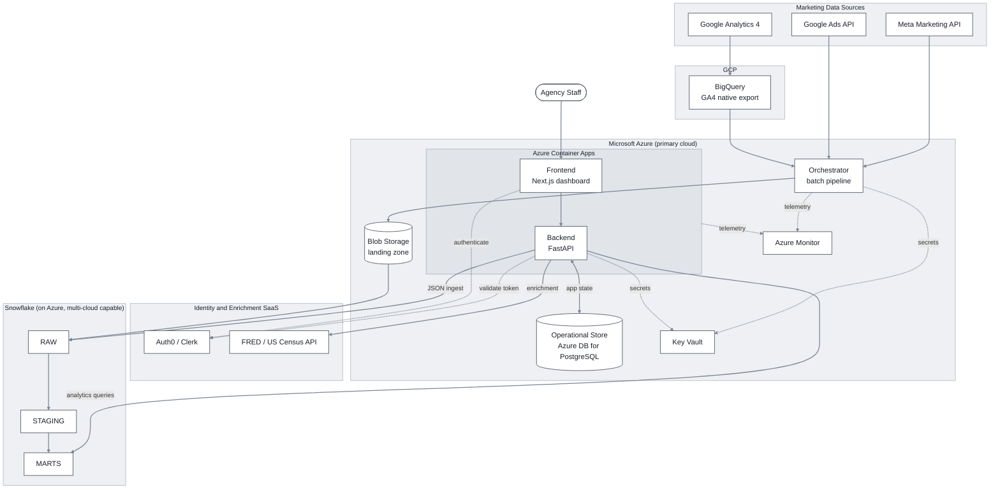
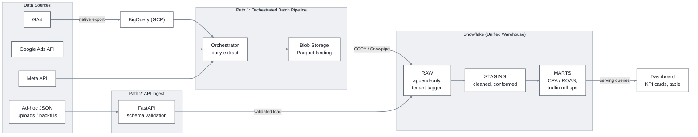

# Part 1 — Architecture & Systems Design

## 1. High-Level Architecture

### 1.1 System architecture

Deployment view: components, services, and cloud boundaries. Solid edges = data flow. Dashed edges = control plane (auth, secrets, telemetry).



**Component inventory:**

- **Frontend** — Next.js dashboard on Azure Container Apps (§5.2).
- **Backend** — FastAPI on Azure Container Apps. Serves analytics from Snowflake marts, reads/writes app state to the operational store.
- **Orchestrator** — daily batch pipeline; tooling in Section 3.
- **Operational store** — Azure DB for PostgreSQL; transactional app state (§3.6, §4.5).
- **Analytical warehouse** — Snowflake, `RAW` → `STAGING` → `MARTS` (§4).
- **Supporting Azure services** — Blob Storage (landing zone), Key Vault (secrets), Azure Monitor (observability).
- **External** — GA4 (BigQuery export), Google Ads + Meta APIs, Auth0/Clerk for identity, FRED / US Census for Section 4 enrichment.

### 1.2 Data flow

Both ingestion paths converge on the warehouse.



**Daily ingestion run:**

1. **Trigger.** Orchestrator runs on schedule.
2. **Extract** (parallel). GA4 from BigQuery export; Google Ads and Meta from their APIs.
3. **Land.** Write to Blob Storage as Parquet.
4. **Load.** `COPY` Parquet into Snowflake `RAW`, stamped with `tenant_id` + load timestamp.
5. **Transform.** `RAW` → `STAGING` (clean, conform) → `MARTS` (daily client-level CPA, ROAS, traffic roll-ups).
6. **Idempotent.** Every step is partition-replace; retries don't duplicate (§3.3).

**Dashboard request:**

1. **Authenticate.** Frontend sends Auth0/Clerk token.
2. **Resolve tenant.** Backend validates token, picks the **active tenant** (single tenant for external clients; client-selector choice for staff).
3. **Bind session.** `tenant_id` set as a session variable on the DB connection.
4. **Query.** Backend hits Snowflake `MARTS`; RLS binds the query to that tenant.
5. **Return.** Paginated response to the frontend.
6. **Enrich.** FRED/Census data fetched alongside and blended in.

### 1.3 How the rest reads

Each section below = one decision: multi-tenancy (§2), ingestion (§3), warehouse (§4), Azure-first / multi-cloud (§5), IaC (§6), versioning + rollback (§7), monitoring (§8).

## 2. Multi-Tenancy & Tenant Isolation

**Decision:** Shared schema + row-level security (RLS). Every tenant-scoped row carries `tenant_id`. Two user types — external clients and internal agency staff — share one tenant boundary.

### 2.1 Two user types, one tenant boundary

The brief gives two clues; the design serves both:

- Section 1: *"the user [monitors] their website"* → external clients log in to view their own data.
- Section 4: *client selector* → a user picks among many clients = agency-staff view.

A **tenant is a client** (an advertiser or website the agency manages). The two user types use the boundary differently:

- **External users** = client staff. Pinned to one tenant. No client selector, or shows only their own org.
- **Internal users** = agency staff. Permission set spans many tenants. Client selector switches the active tenant; one active tenant per session.

Every request operates under exactly one `tenant_id`. Because external clients share infrastructure through the operator, the tenant boundary is a **security boundary** in the strict sense. This is NFR-1 in its strong form.

### 2.2 Isolation models considered

| Model                   | Isolation | Cost as tenants grow | Onboarding a tenant  | Cross-client analytics         | Ops overhead |
| ----------------------- | --------- | -------------------- | -------------------- | ------------------------------ | ------------ |
| **Shared schema + RLS** | Logical   | Flat                 | Insert a row         | Trivial, one query             | Low          |
| Schema-per-tenant       | Stronger  | Grows per tenant     | Provision a schema   | Moderate, union across schemas | Medium       |
| Database-per-tenant     | Physical  | Linear and steep     | Provision a database | Hard, cross-database joins     | High         |

### 2.3 Why shared schema + RLS

- **Agency staff need cross-client analytics.** KPI roll-ups, the client selector, portfolio-wide anomaly detection. Schema/db-per-tenant make these queries painful; shared schema = `WHERE tenant_id = ?` or `GROUP BY tenant_id`.
- **Cost and ops should not scale with tenant count.** Section 3 assumes ~10k Google Ads + ~20k Meta campaigns across many clients. Per-tenant ops growth = wrong shape. Shared schema is flat.
- **RLS makes logical isolation enforceable.** The database itself refuses to return another tenant's rows; isolation does not depend on every query being right.
- **Would choose differently if:** regulated data (HIPAA, certain financial), contractual physical isolation, per-tenant residency, or materially varied tenant schemas. None apply.

### 2.4 How isolation is enforced

Three layers; no single bug breaks it:

1. **Authentication (Auth0/Clerk).** Token carries identity + **set of permitted tenants**. One element for external users, many for staff.
2. **Tenant context per request.** Backend resolves the **active tenant** (external: their only tenant; staff: client selector choice, validated against the permission set), then sets it as a session variable on the DB connection.
3. **RLS in both stores.** Every tenant-scoped table has non-null `tenant_id`. RLS policies bind queries to the session tenant. Snowflake: row access policy keyed on the session variable. Postgres: `CREATE POLICY` rule. A query physically cannot return another tenant's rows.

### 2.5 The tenant_id key

- Generated once at client onboarding in the operational store's `tenants` table (§3.6).
- Immutable from then on.
- Same value as **Client ID** from the brief's Client Table schema.
- One ID across operational store, warehouse, and pipeline.

**Two supporting tables:**

- `tenant_integrations` — each tenant's external accounts (Google Ads customer ID, Meta `act_<id>`, GA4 property) + Key Vault `credentials_ref`. Read by the pipeline.
- `user_tenant_access` — which users may act on which tenants. Read by the API.

**Core rule:** the data itself never carries a trusted `tenant_id`. Both ingestion paths resolve it from the operational store and stamp it at the boundary.

**Batch pipeline:**

1. Orchestrator queries `tenant_integrations`.
2. Loads credentials from Key Vault via `credentials_ref`; `tenant_id` is bound to the task.
3. Task runs with `tenant_id` in context.
4. Records get `tenant_id` on load into `RAW`.

**FastAPI JSON ingest:**

1. Caller presents an Auth0/Clerk token.
2. Backend resolves the active tenant (external: only tenant; staff: declared tenant validated against `user_tenant_access`).
3. Records get the resolved `tenant_id` on ingest.
4. Any `tenant_id` in the request body is ignored or required to match.

Records without a verified `tenant_id` are rejected. Both paths resolve from the same `tenants` table, so data lands with the same `tenant_id` by construction.

**Offboarding (out of scope for this assessment):**

1. Delete the tenant's users from Clerk → blocks further access.
2. Kick off an async Snowflake sweep, deleting per the retention policy.
3. Delete operational-store rows for that `tenant_id`.

Order matters: cut access first, then purge.

**Within-tenant RBAC (out of scope for this assessment).** Same pattern, finer grain: `user_tenant_access.role` controls intra-tenant actions; FastAPI dependencies on mutating endpoints check the role.

## 3. Data Ingestion & Flow

**Decision:** GA4 via the native BigQuery export, moved into Snowflake by an orchestrator-driven job. Two ingestion paths (batch pipeline + FastAPI JSON ingest) converge on Snowflake through `RAW → STAGING → MARTS`.

### 3.1 GA4 ingestion: native BigQuery export

GA4 traffic data is ingested through **GA4's native BigQuery export**: raw event-level rows, one row per event, no sampling.

**Why:**

- **Raw and unsampled.** Every downstream metric (sessions, users, traffic by source/medium, conversions) is derived in our own warehouse. Sampled inputs cap the trustworthiness of every chart built on them.
- **Future-proof.** A new metric = a new query over data we already hold, not a new integration.
- **Free.** Configured once in the GA4 admin UI; no per-request cost.

**Trade-offs accepted:**

- Daily-batch on the free tier (intraday/streaming need GA4 360). Daily granularity fits a traffic-analytics product.
- Lands in GCP, not Azure. The cross-cloud hop is addressed in §3.2.

**Alternative considered: the GA4 Data API** (REST, pre-aggregated reports).

**Why it loses:**

- **Sampling** on high-cardinality queries. You get GA4's answers, not GA4's data.
- **Capped queries.** Dimension/metric limits force stitching many requests together.
- **Locked-in shape.** Pre-formed questions only; new metrics later = a second integration.

### 3.2 The cross-cloud hop, on purpose

GA4 data sits in **BigQuery, on GCP**. Everything else (compute, orchestration, application, Snowflake warehouse) runs on **Azure**. Data crosses one cloud boundary on the way in. Deliberate, not drift.

The brief: *"Azure-first but multi-cloud capable."* Real multi-cloud is driven by where data is born. GA4 data is born in Google's ecosystem; its highest-fidelity export target is BigQuery. Scraping the Data API just to stay inside Azure means accepting sampled data to satisfy a preference.

- **GCP** — holds GA4 raw transiently (export tables only).
- **Azure** — compute, orchestration, application, Snowflake's deployment region.
- **Snowflake** — cloud-agnostic warehouse layer; deployed on Azure today, identical product on AWS/GCP.

Azure-first is honored everywhere there's a real choice. The GCP touchpoint exists only because GA4 data is there, scoped to one extract step.

### 3.3 Moving BigQuery to Snowflake

The same orchestrator that runs the Section 3 batch pipeline owns this hop:

1. **Extract.** Daily job exports the prior day's GA4 `events_*` tables from BigQuery to a cloud storage bucket as Parquet.
2. **Stage.** Files exposed to Snowflake through an external stage that reads Parquet directly.
3. **Load.** `COPY INTO` (or Snowpipe) loads into Snowflake `RAW`, stamped with `tenant_id` and a load timestamp.
4. **Idempotency.** Keyed by date partition; re-running a day replaces it.

**Orchestrator-driven over a managed connector (Fivetran, Airbyte):** vendor-free, one control plane for every ingestion path, one alerting/retry story. Cost: we own the code; fair trade for a pipeline this well-defined. Orchestration tooling selected in Section 3.

### 3.4 Two ingestion paths, one warehouse

- **Path 1: orchestrated batch pipeline.** Scheduled daily extracts of GA4, Google Ads, Meta. High volume, predictable, retry-safe. Primary path. Section 3 SLAs apply.
- **Path 2: FastAPI JSON ingest, fully async.** Request-driven; ad-hoc uploads, backfills, sources without a batch connector. Validates each record against the Google Ads, Meta, or Client Table schema (Pydantic models matching [Part 3 §4.2](./part-3-data-engineering.md#42-staging-table-models)).

**The ingest API is one async pattern for all payloads, any size.** Bytes always travel client → blob directly (presigned URL); the backend never proxies them. The backend's role is to orchestrate the upload lifecycle and hand off to Airflow.

| Step | Endpoint                          | What happens                                                                                                                                                  |
| ---- | --------------------------------- | ------------------------------------------------------------------------------------------------------------------------------------------------------------- |
| 1    | **`POST /uploads/initiate`**      | Body declares `{ type: "google_ads" \| "meta" \| "clients" }`. Backend creates an `uploads` row with the type, returns `{ upload_id, presigned_url }` (short-lived). |
| 2    | Client `PUT`s payload to `presigned_url` | Bytes go straight to Blob Storage; backend doesn't see them.                                                                                          |
| 3    | **`POST /uploads/{id}/commit`**   | Signals the upload is complete. Backend triggers the Airflow DAG. Returns **`202 Accepted`** with `{ upload_id, status: "processing" }`.                       |
| 4    | **`GET /uploads/{id}`**           | Client polls. Returns `{ status: pending \| processing \| succeeded \| failed, accepted, rejected, error }`. Safe, idempotent.                                |

The Airflow `uploads_ingest_dag` (parameterized with `upload_id`) reads the blob, looks up the schema type from the `uploads` row, selects the matching Pydantic model, validates, writes valid records to the right staging table (`stg_google_ads`, `stg_meta_ads`, or `dim_client`), writes invalid records to dead-letter, and updates the `uploads` row. **Pydantic validation is authoritative server-side.** Client-side validation is a UX accelerator only. Failed records go to the same dead-letter table the batch path uses (Part 3 §7.4).

**Why one transport for all sizes?**

- Same flow whether the payload is 1 record or 1 GB.
- Eliminates the small-vs-large branching that adds API surface and decision overhead.
- Cost: 3-4 round trips per upload (initiate, upload, commit, poll). Acceptable — the dashboard is primarily a read surface and interactive inserts are rare.

**Why always async, no synchronous validation?**

- Validating 1000 records takes ~2-3 seconds; a 100 MB file takes 5-10 minutes.
- Synchronous validation hangs HTTP workers and risks timeouts.
- The async pattern gives one UX contract everywhere: initiate → upload → commit → poll.

**Why route through Airflow rather than a separate validator service?**

- JSON uploads are not the main use case of this product — the scheduled daily pipeline (Part 3) is.
- A dedicated validator service would mean operating **two async work systems** for a low-frequency activity.
- Reusing the Airflow we already run keeps the design single-orchestrator.
- If upload volume eventually justifies its own service, splitting it out is a contained change.

**Scaling under burst.** If many large uploads arrive at once (e.g. 10 tenants upload 1 GB files simultaneously):

- **Each upload creates a DAG run**, queued by the Airflow scheduler with the `upload_id` parameter.
- **Worker pool scales with KEDA.** Airflow's CeleryExecutor workers are Container Apps replicas; KEDA scales the replica count on Celery queue depth (min 2, max ~10). Workers spin up under burst and scale back down when idle.
- **Concurrency caps prevent thundering herds.** `max_active_runs_per_dag` bounds simultaneous DAG runs; an Airflow pool (`snowflake_writes_pool`) bounds concurrent `COPY INTO` operations on `WH_INGEST`. Excess work queues, never fails.
- **Backpressure is graceful.** A tenant's `GET /uploads/{id}` shows `pending` (queued) → `processing` (worker assigned) → `succeeded`/`failed`. The real bottleneck under load is usually warehouse write throughput, not Airflow itself.

For the 10-tenant 1 GB scenario: workers scale to 10, validations run in parallel, Snowflake pool bounds concurrent loads to 4, total wall time ≈ 15 min. No crashes; longer wait times.

Keeping both paths is deliberate: batch handles bulk + schedule; API gives an on-demand entry point. One destination, one tenant-tagging rule (§2.5), uniform data downstream.

### 3.5 Layered storage: raw → staging → marts

Inside Snowflake, three layers (medallion pattern):

- **Raw.** What arrived: append-only, tenant-tagged, untransformed.
- **Staging.** Cleaned and conformed: types enforced, schemas aligned, deduplicated, common grain.
- **Marts.** Query-ready: daily client-level CPA and ROAS (Section 3), GA4 traffic roll-ups, dashboard aggregates.

Dashboard and serving layer read **marts only**. Transformation bugs are fixed by reprocessing from raw, never by re-ingesting.

### 3.6 Operational vs analytical store

- **Analytical store — Snowflake.** Large scans, historical data, marts. §4.
- **Operational store — managed Postgres / Azure SQL.** Transactional app state: `tenants`, `tenant_integrations`, `user_tenant_access`, ingestion job metadata, Section 2 landing tables. Low-latency point reads/writes.

FastAPI reads analytics from Snowflake and reads/writes app state to the operational store. Both enforce the same `tenant_id` RLS boundary from §2.

## 4. Unified Data Warehouse

**Decision:** Snowflake on Azure = unified analytical warehouse. Operational store = managed Postgres / Azure SQL (§3.6).

### 4.1 The requirement

One analytical home for GA4 traffic + Google Ads + Meta. Must:

- Hold Section 3 volume (~10k Google Ads + ~20k Meta campaigns/day, plus GA4 events, accumulating).
- Serve heavy daily ingestion + interactive dashboard queries.
- Be Azure-first but multi-cloud capable (NFR-2).

### 4.2 Alternatives considered

| Warehouse        | Azure-first      | Multi-cloud             | Compute model                                | Notes                                                                               |
| ---------------- | ---------------- | ----------------------- | -------------------------------------------- | ----------------------------------------------------------------------------------- |
| Azure Synapse    | Native           | Azure-only              | Provisioned / serverless SQL pools           | First-party, but Microsoft is steering new investment toward Fabric                 |
| Microsoft Fabric | Native           | Azure-only              | Capacity-based SaaS                          | Newest first-party platform, tightly Azure-bound                                    |
| **Snowflake**    | Deploys on Azure | Yes (Azure / AWS / GCP) | Per-warehouse, compute and storage separated | The identical product runs on every major cloud                                     |
| Databricks       | Runs on Azure    | Yes                     | Spark clusters / SQL warehouses              | Lakehouse, strong for machine learning (ML); heavier to operate as a pure warehouse |

### 4.3 Why Snowflake

1. **Only option that satisfies "Azure-first AND multi-cloud" without compromise.** Synapse and Fabric are Azure-only. Snowflake deploys on Azure today; identical product on AWS and GCP.
2. **Per-virtual-warehouse isolation fits a spiky workload.** Separated compute/storage is table stakes (Databricks does it too). Snowflake's edge: each virtual warehouse = a discrete cluster with its own queue + fast auto-suspend. Ingestion and serving get their own warehouse; daily load cannot slow a dashboard; idle warehouses don't bill.
3. **Operationally light.** No clusters to size, no Spark to tune. Databricks is more capable for heavy ML training and the lakehouse pattern, but overkill for SQL analytics. Snowflake has its own ML/AI surfaces (Snowpark ML, Cortex) if needed later.
4. **Standard SQL keeps marts portable.** Section 3's CPA/ROAS and anomaly SQL avoids engine-specific features; the analytical layer itself moves, not just the platform around it.

**Would choose differently if:** deep in the Microsoft data estate (Power BI, Fabric, Purview) + multi-cloud genuinely notional → Fabric. ML-first at training scale → Databricks.

### 4.4 How Snowflake is organized

- **Layered databases/schemas** mirror §3.5: `RAW`, `STAGING`, `MARTS`. Schema separation = explicit grants and lineage.
- **Tenant isolation:** every tenant-scoped table carries `tenant_id`; row access policy keyed on session tenant variable enforces §2's RLS.
- **Virtual warehouses:** `WH_INGEST` for the pipeline, `WH_SERVING` for backend/dashboard, sized independently, auto-suspend when idle. `WH_SERVING` is **multi-cluster** so concurrent dashboard requests spawn extra clusters instead of queueing.
- **Clustering on `(tenant_id, date)`** on large fact and mart tables. Every query has a `tenant_id` predicate (RLS) and usually a date filter; clustering aligns with both for pruning. At today's volume the value is architectural; the design stays correct as data grows.
- **Time Travel** = cheap point-in-time recovery; underpins part of rollback (§7).

### 4.5 Why two stores, not one

Snowflake is built for large analytical scans, not high-frequency point reads/writes. App state (tenant config, permissions, job metadata, Section 2 landing tables) on a warehouse = slow transactions + per-query compute cost on tiny operations.

- **Operational store** = app state.
- **Snowflake** = analytics.

"Unified warehouse" refers to the analytical layer, and there it holds: GA4 + Google Ads + Meta share one analytical home. The operational store is a deliberately small, separate concern.

## 5. Azure-First, Multi-Cloud Strategy

**Decision:** Backend and frontend on Azure Container Apps. Portability via containers, Snowflake (cloud-agnostic warehouse), and Terraform.

### 5.1 What "Azure-first but multi-cloud capable" means

Three readings; we commit to one:

- **Azure-first** → Azure is the default; the system runs there today and is optimized for it.
- **Multi-cloud capable** → a move to AWS/GCP is a planned, bounded migration, not a rewrite.
- **Not** active-active multi-cloud → not running on all clouds simultaneously. Far more expensive; the brief doesn't ask for it.

**Target: single-cloud deployment on Azure with a portable foundation.** The rest of this section makes the second half true.

### 5.2 Compute: why Azure Container Apps

| Option                         | Portability        | Ops burden                 | Fit                                                                     |
| ------------------------------ | ------------------ | -------------------------- | ----------------------------------------------------------------------- |
| AKS (Azure Kubernetes Service) | Highest            | Full Kubernetes operations | Overkill for two services                                               |
| App Service                    | Low, Azure-coupled | Low                        | Platform-as-a-service (PaaS), but couples to an Azure code-deploy model |
| Functions                      | Low                | Low                        | Wrong shape: services are long-lived, not event-triggered               |
| **Container Apps**             | High               | Low                        | Serverless containers, scale-to-zero, built-in revisions                |

Container Apps = PaaS-level simplicity, deployable artifact stays a plain Open Container Initiative (OCI) image. Built-in revisions, ingress, KEDA-driven autoscaling, no Kubernetes control plane to operate. Revisions underpin application rollback (§7).

**Stateless backend, automatic scale:**

- No in-process session state. Tokens validated per request; tenant context = token + DB session variable (§2.4).
- Any replica can serve any request.
- KEDA adds replicas on HTTP concurrency.
- Backend mostly orchestrates (validate, set tenant context, query Snowflake or Postgres); scaling = request volume, not per-request compute.

**Edge layer:**

- Public traffic enters through **Azure Front Door + WAF**, not Container Apps' ingress directly.
- Front Door handles: TLS termination, per-IP rate limiting, DDoS protection, WAF rules.
- One Azure service, no application change.
- Equivalents on every cloud (CloudFront + WAF on AWS, Cloud Armor on GCP). Portability unaffected.

### 5.3 Portability inventory

| Component                     | Azure service                | Portability     | How it moves                                                                       |
| ----------------------------- | ---------------------------- | --------------- | ---------------------------------------------------------------------------------- |
| Frontend (Next.js)            | Container Apps               | Portable        | Container image runs on any container runtime                                      |
| Backend (FastAPI)             | Container Apps               | Portable        | Same                                                                               |
| Analytical warehouse          | Snowflake on Azure           | Portable        | Snowflake runs on AWS/GCP; SQL is standard                                         |
| Operational store             | Azure DB for PostgreSQL      | Mostly portable | Postgres is everywhere; managed-service config differs                             |
| Object storage / landing zone | Azure Blob Storage           | Abstracted      | Behind a storage interface; swap to S3/GCS                                         |
| Secrets                       | Azure Key Vault              | Coupled         | Behind a secrets interface; swap to AWS/GCP secret manager                         |
| Identity                      | Auth0 / Clerk                | Cloud-neutral   | Already off-cloud, no change                                                       |
| Observability                 | Azure Monitor / App Insights | Coupled         | OpenTelemetry emission keeps the backend swappable                                 |
| Edge / ingress                | Azure Front Door + WAF       | Coupled         | Equivalents on AWS (CloudFront + WAF) and GCP (Cloud Armor); Terraform module swap |
| IaC                           | Terraform                    | Portable        | Provider blocks change, module structure stays                                     |

### 5.4 Design rules that keep it portable

Followed throughout the build:

- Containerize every service.
- One IaC tool (Terraform) across every provider; never an Azure-only tool (see §6).
- Cloud-specific SDK calls (blob, secrets) behind a thin internal interface; swap = one module.
- Telemetry through OpenTelemetry; observability backend = configuration, not code.
- Warehouse SQL standard; avoid engine-specific syntax where practical.
- No proprietary serverless glue in app code (no Logic Apps, no Azure-specific event bindings).

### 5.5 The migration path

What moving to AWS actually takes:

- **Compute:** Container Apps → ECS Fargate or App Runner. Same image; swapped Terraform module.
- **Warehouse:** Snowflake already multi-cloud. Stand up or replicate to a Snowflake account on AWS via cross-cloud replication.
- **Object storage:** Azure Blob → S3. Storage interface's implementation changes.
- **Secrets:** Key Vault → AWS Secrets Manager. Secrets interface's implementation changes.
- **Operational store:** Azure DB for PostgreSQL → RDS for PostgreSQL. Connection string + Terraform module.
- **Observability:** App Insights → CloudWatch or managed Grafana. OpenTelemetry exporter reconfigured.
- **Identity:** Auth0 / Clerk unchanged.

**Does not change:** application code (apart from the two abstraction modules), warehouse schema and SQL, container images, Terraform structure. Migration = bounded infrastructure-layer move measured in weeks.

### 5.6 Honest accounting of coupling

Not zero-lock-in. The coupled surfaces:

- **Key Vault and App Insights** — application code is insulated (secrets interface, OpenTelemetry), but the Terraform is Azure-specific and would be rewritten on migration.
- **Orchestrator (Section 3)** — if Azure Data Factory is chosen over container-hosted Airflow, orchestration becomes Azure-bound. Section 3 addresses it.

Accepting some coupling is correct. Chasing zero lock-in forces a lowest-common-denominator architecture and a real, ongoing cost. The coupled surface is small, insulated, and confined to the infrastructure layer.

## 6. Infrastructure as Code

**Decision:** Infrastructure defined as code in **Terraform**. Strategy, structure, state model, delivery documented here. No Terraform committed to this repo — the IaC layer is documented, not implemented, since cloud accounts are out of scope for the assessment.

### 6.1 Why Terraform over Bicep

Bicep is the Azure-native choice; smoother day-one Azure, no state file. Terraform anyway:

- **Only tool consistent with multi-cloud.** Bicep is Azure-only. Choosing it = rewriting all IaC on any move to AWS/GCP, and reaching for a second tool anyway (Snowflake).
- **One tool, one language, every provider.** Terraform provisions Azure + Snowflake (via the Snowflake provider) + a future AWS/GCP footprint in a single HCL codebase.
- **Trade-off accepted:** Terraform introduces a state file (§6.4). For a portability goal, it's worth paying.

### 6.2 What gets provisioned

| Layer             | Resources                                                                                                                                                             |
| ----------------- | --------------------------------------------------------------------------------------------------------------------------------------------------------------------- |
| Foundation        | Resource group, virtual network (VNet), subnets, private endpoints                                                                                                    |
| Compute           | Azure Container Apps environment, frontend and backend container apps, Azure Container Registry                                                                       |
| Operational store | Azure Database for PostgreSQL Flexible Server                                                                                                                         |
| Landing zone      | Storage account and Blob container for Parquet staging                                                                                                                |
| Analytical store  | Snowflake databases (`RAW`, `STAGING`, `MARTS`), virtual warehouses (`WH_INGEST`, `WH_SERVING`), roles, and row access policy scaffolding, via the Snowflake provider |
| Secrets           | Key Vault, with access policies for the services that read from it                                                                                                    |
| Observability     | Log Analytics workspace and Application Insights                                                                                                                      |

### 6.3 Module and environment structure

Reusable modules, composed per environment:

```
infrastructure/
├── modules/            # Reusable building blocks
│   ├── networking/
│   ├── container-app/
│   ├── postgres/
│   ├── snowflake/
│   └── observability/
├── environments/
│   ├── dev/            # Composes modules with dev-scale sizing
│   ├── staging/
│   └── prod/
└── bootstrap/          # Creates the remote state backend (run once)
```

Each environment composes the same modules with environment-specific sizing (e.g. smaller Container Apps scale + smaller Postgres tier in `dev`). Identical structure means `dev` is a faithful rehearsal of `prod`.

### 6.4 State management

- **Remote state** in a dedicated Azure Storage account; one state file per environment.
- **Locking** via the storage account's native blob lease.
- **Blob versioning** on the state container = prior state recoverable (supports §7 rollback).
- **Bootstrap** — chicken-and-egg solved by a small `bootstrap/` configuration that creates the storage account once.

### 6.5 Delivery

- Pull request → `terraform plan` for review.
- Merge → `terraform apply`.
- Same pipeline shape as application code; ties to §7 versioning.

## 7. Versioning & Rollback

Change happens at three independent layers. Treating them as one is the usual cause of a rollback that can't be performed when needed.

### 7.1 Versioning across the three layers

- **Infrastructure.** Terraform in Git. Every change = a pull request. Repo tagged with semver per release. State versioned in the storage backend (§6.4) → any past release recoverable.
- **Application.** Every build = an immutable container image tagged with semver + Git SHA. Stored in Azure Container Registry. No `latest` in prod; a version refers to exactly one artifact.
- **Data schema.** Ordered, versioned migration files in Git alongside the code that depends on them. Alembic for operational Postgres; versioned SQL scripts for Snowflake. A schema version is tied to an application version.

### 7.2 Rollback by layer

| Layer          | Rollback mechanism                                                                           | Speed   |
| -------------- | -------------------------------------------------------------------------------------------- | ------- |
| Application    | Shift traffic back to the previous Container Apps revision                                   | Seconds |
| Infrastructure | `terraform apply` of the previous tagged commit                                              | Minutes |
| Data schema    | Down-migration, or expand/contract (see §7.3); Snowflake Time Travel for data-level recovery | Varies  |

- Application rollback = fast path, used most. Each deploy is a new immutable revision; rollback = traffic shift, not a rebuild.
- Infrastructure rollback = rarer, slower: re-apply previous tagged Terraform commit.
- Schema rollback = most delicate; §7.3 addresses it directly.

### 7.3 A deployment strategy that makes rollback cheap

Cheap rollback is designed in, not bolted on:

- **Revision-based canary deploys.** New revision deployed with 0% traffic, smoke-tested, traffic ramps up. Errors climb → traffic shifts back. Rollback and deploy are the same mechanism run in reverse.
- **Expand/contract for schema changes.** Phase 1: expand (add column, backfill, dual-write). Phase 2: ship the app that uses it. Phase 3: contract (drop the old column) once new is proven. A rollback never requires dropping a column that live traffic still reads.
- **CI gates before any apply.** Tests, reviewed `terraform plan`, migration checks. Rollback becomes the exception, not the routine.

### 7.4 Disaster recovery posture

**Single-region on Azure.** Cross-region availability = periodic snapshots to a paired region, not active-active.

- **Operational Postgres:** built-in point-in-time backups + periodic logical dumps copied to Blob in a paired region.
- **Snowflake:** cross-region replication on a daily snapshot cadence.
- **Blob landing zone:** geo-redundant storage (GZRS) replicates to the paired region automatically.
- **Terraform state (§6.4):** blob versioning on geo-redundant storage.

**Stated targets:**

| Objective | Target | Meaning |
|-----------|--------|---------|
| **RPO** (Recovery Point Objective, data-loss budget) | 24 hours | At worst, one day of data lost in a region outage. |
| **RTO** (Recovery Time Objective, downtime budget) | 8 hours | System back up within 8 hours, restoring from cross-region snapshots into the paired region. |

Targets illustrative; real numbers set with the business against cost. Honest single-region posture with a documented cross-region recovery path — not an active-active claim we can't back up.

## 8. Monitoring & Observability

**Decision:** Native Azure tooling — Azure Monitor + Application Insights as the backend; logs, metrics, traces emitted through OpenTelemetry from services we own (§5.4). Logs at **INFO and above** in production, **structured JSON** wherever the language allows.

**Alternative considered: self-hosted Grafana** (Loki for logs, Mimir/Prometheus for metrics, Tempo for traces). More portable; better dashboard UI than the Azure portal. Costs more upfront setup + ongoing ops. Azure tooling gives zero-config Container Apps log capture, unified RBAC, single billing line. Picked Azure-native on the same logic as everywhere else (§5); coupling acknowledged in §5.6.

Two questions to answer: is the system healthy now, and if not, why. Built so the path from alert to root cause is short.

### 8.1 The three signals

- **Metrics.** Request rate, latency, error rate per service; Container Apps scaling; Postgres connections; Snowflake query duration + credit consumption; pipeline run duration + row counts.
- **Logs.** Structured JSON from frontend, backend, orchestrator → Log Analytics. Every backend log line carries `tenant_id` and a correlation ID.
- **Traces.** Distributed traces via OpenTelemetry → App Insights. A single user request traceable end-to-end (frontend → backend → Snowflake).

OpenTelemetry keeps the observability backend swappable; the monitoring strategy itself isn't a source of cloud lock-in.

### 8.2 What is watched at each layer

| Layer             | Key signals                                                                                         |
| ----------------- | --------------------------------------------------------------------------------------------------- |
| Frontend          | Page load time, JavaScript errors, error-boundary hits, real user monitoring                        |
| Backend           | Rate, errors, and duration per endpoint; auth failures; tenant context on every log                 |
| Pipeline          | Per-run status, duration, rows in and out, and data freshness (time since the last successful load) |
| Warehouse         | Query performance, credit consumption as a cost guardrail, row access policy errors                 |
| Operational store | Connection counts, slow queries, storage headroom                                                   |

**Data freshness is a first-class signal.** For an analytics product, stale data is a failure even when every service reports healthy.

### 8.3 Dashboards and diagnosis path

- **Three standing dashboards:** platform health (serving path), pipeline health (freshness + run history), cost (Snowflake credits + Azure spend).
- **Diagnosis path is short.** Alert → linked dashboard → pivot to logs and traces via correlation ID and `tenant_id`.
- Moves from "something is wrong" to "this query, for this tenant, in this trace" without guesswork.

## 9. Summary

### 9.1 The architecture in brief

- **Multi-tenant** for an agency; shared schema + RLS (§2).
- **GA4** via native BigQuery export; **Google Ads + Meta** via orchestrated pipeline (§3).
- **Snowflake** as the unified warehouse — only option that is both Azure-deployable and genuinely multi-cloud (§4).
- **Azure Container Apps** for compute; portability via containers, Terraform, thin abstractions (§5).
- **Terraform IaC** (documented, not committed) (§6).
- **Explicit versioning + rollback + DR + observability** (§7, §8).

### 9.2 Requirements coverage

| Requirement                             | Addressed in       |
| --------------------------------------- | ------------------ |
| FR-1.1 Multi-tenant analytics system    | §1, §2             |
| FR-1.2 Google Analytics 4 as the source | §3                 |
| FR-1.3 React / Next.js front end        | §1, §5             |
| FR-1.4 Python / Node backend            | §1, §5             |
| FR-1.5 Unified data warehouse           | §3, §4             |
| FR-1.6 Diagrams and detailed reasoning  | §1, and throughout |
| FR-1.7 Infrastructure as Code           | §6                 |
| NFR-1 Tenant isolation                  | §2                 |
| NFR-2 Azure-first, multi-cloud capable  | §4, §5             |
| NFR-5 Versioning                        | §7                 |
| NFR-6 Rollback                          | §7                 |
| NFR-7 Monitoring                        | §8                 |
| NFR-8 Reproducible infrastructure       | §6                 |

---

## Decision Log

| Area              | Decision                           | Reasoning |
| ----------------- | ---------------------------------- | --------- |
| Multi-tenancy     | Shared schema + row-level security | _§2_      |
| Warehouse         | Snowflake on Azure                 | _§4_      |
| Compute / hosting | Azure Container Apps               | _§5_      |
| GA4 ingestion     | Native BigQuery export → Snowflake | _§3_      |
| IaC               | Terraform                          | _§6_      |
