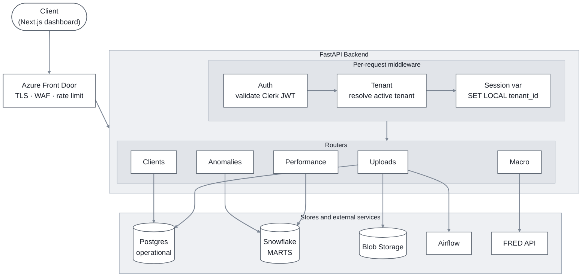

# Part 2 — Backend (FastAPI)

## 1. Overview

### 1.1 What this service is

A FastAPI service between data sources (Part 3 pipeline, ad-hoc JSON uploads) and the Part 4 dashboard. Ingests marketing data, persists it, serves dashboard reads from the Part 3 marts.

### 1.2 What this service is not

- **Not the analytical engine.** Heavy aggregations live in Snowflake (Part 1 §4); the backend queries the marts.
- **Not the orchestrator.** Scheduled extractions are Airflow's job (Part 3 §2).
- **Not the system of record for clients.** Master data lives in the operational store's `tenants` / `tenant_integrations` (Part 1 §2.5).

### 1.3 How it connects to the rest of the system

- Runs on Azure Container Apps (Part 1 §5.2), behind Azure Front Door + WAF.
- Writes to operational Postgres for app state and upload metadata.
- Reads Snowflake `MARTS` for analytics.
- Tenant scoping inherits Part 1 §2.4's three-layer model (token → session variable → RLS).

### 1.4 Request flow

Edge → middleware chain → router → store. Each routed handler talks only to the stores it needs.



Three things this diagram makes visible at a glance:

- **The middleware chain** (auth → tenant → session var) runs on every authenticated request, in order. The session variable is set before any router code runs, so RLS is already armed by the time a query fires.
- **Routers are thin.** Each handler maps to one or two stores; no router talks to everything.
- **The stores are heterogeneous on purpose.** Uploads write to Postgres + Blob + Airflow; mart reads hit Snowflake; the macro endpoint proxies FRED.

### 1.5 Authentication

**Decision:** Clerk (managed identity provider, SaaS). Issues and signs JWTs; the backend validates them and reads tenant context from each user's `publicMetadata`.

- Three demo users in Clerk: two single-tenant clients + one agency-staff user with access to all three demo tenants.
- Real auth, not a stub. Integration details in §6.
- No cloud account or paid plan required — Clerk's free tier covers the demo.

**Alternative considered: Auth0.** Same integration shape (validate JWT, read claims); swap is mechanical. Clerk wins on Next.js integration polish; Auth0 wins on enterprise familiarity. Either is defensible.

## 2. API Surface

**Decision:** Two halves — **one async write pattern** for ingestion, **mart-shaped reads** for queries.

- **Writes:** single ingest pattern (initiate → upload-to-blob → commit → poll). Type-agnostic at the API layer; the worker dispatches on the schema type stored at initiate.
- **Reads:** endpoints map to marts and the client dimension, not to raw staging. The marts (Part 3 §9) exist so the serving layer doesn't join paid-media sources at query time.

### 2.1 Endpoint inventory

| Endpoint                       | Method | Behavior                                    | Notes                                                                                            |
| ------------------------------ | ------ | ------------------------------------------- | ------------------------------------------------------------------------------------------------ |
| `POST /uploads/initiate`       | Write  | Returns `{ upload_id, presigned_url }`      | Body: `{ type: "google_ads" \| "meta" \| "clients" }`. Short-lived presigned blob URL.           |
| `POST /uploads/{id}/commit`    | Write  | Returns `202` with `{ status: processing }` | Signals upload complete; triggers async ingest                                                   |
| `GET /uploads/{id}`            | Read   | Returns `{ status, accepted, rejected }`    | Polled by client; status = `pending` \| `processing` \| `succeeded` \| `failed`                  |
| `GET /clients`                 | Read   | `dim_client`                                | Client list for the dashboard selector                                                           |
| `GET /performance`             | Read   | `mart_client_daily_performance`             | Daily client-level rows; paginated + filtered                                                    |
| `GET /anomalies`               | Read   | `mart_client_daily_anomalies`               | Flagged anomalies for the dashboard                                                              |
| `GET /macro`                   | Read   | FRED API (cached)                           | Dashboard enrichment data                                                                        |
| `GET /health`                  | Read   | —                                           | Liveness check, no auth                                                                          |
| `GET /docs`                    | Read   | —                                           | OpenAPI (auto-generated by FastAPI)                                                              |

### 2.2 The single async ingest pattern

One pattern for all payloads, any size, any schema:

- **`POST /uploads/initiate`** declares the schema `type`; backend creates the `uploads` row, returns a presigned blob URL + `upload_id`.
- **Client uploads bytes** directly to the presigned URL (bypasses the API).
- **`POST /uploads/{id}/commit`** triggers the Airflow `uploads_ingest_dag`, returns `202`.
- **`GET /uploads/{id}`** for status.

Route handlers are short — fast work only. **No Pydantic dispatch in the route.** The schema `type` is stored on the `uploads` row at `initiate`; the worker reads the row and picks the correct Pydantic model (`GoogleAdsRecord`, `MetaAdsRecord`, or `ClientRecord`) at validation time.

```python
class InitiateRequest(BaseModel):
    type: Literal["google_ads", "meta", "clients"]

@router.post("/uploads/initiate")
async def initiate(
    body: InitiateRequest,
    tenant: TenantContext = Depends(active_tenant),
):
    upload_id = uuid.uuid4()
    presigned_url = await blob.presign_upload(upload_id, ttl=900)
    await db.upload_create(upload_id, tenant_id=tenant.active, type=body.type)
    return {"upload_id": upload_id, "presigned_url": presigned_url}

@router.post("/uploads/{upload_id}/commit", status_code=202)
async def commit(
    upload_id: UUID,
    tenant: TenantContext = Depends(active_tenant),
):
    await db.upload_assert_belongs_to(upload_id, tenant)
    await airflow.trigger_dag("uploads_ingest_dag", conf={"upload_id": str(upload_id)})
    await db.upload_set_status(upload_id, "processing")
    return {"upload_id": upload_id, "status": "processing"}
```

The worker (`uploads_ingest_dag`) reads the blob, selects the Pydantic model by the upload row's `type`, validates, writes records to the right staging table, writes failures to dead-letter, updates the upload row. Validation stays server-side and authoritative — it just runs in the worker, not in the request handler.

**Why store `type` on the `uploads` row?**

- Gives the worker a single source of truth that doesn't depend on how the upload was initiated.
- Keeps the API surface fixed regardless of how many schemas the platform supports.

## 3. Schema Validation

**Decision:** Pydantic models mirror the brief's three schemas one-to-one. Validation runs server-side in the async ingest worker, before records reach staging. The schema `type` is set on the `uploads` row at `initiate`; the worker selects the matching model.

- **Three models:** `GoogleAdsRecord`, `MetaAdsRecord`, `ClientRecord` — one per staging table (Part 3 §3.2).
- **Errors return 422** with field-level detail (FastAPI's default behavior).
- **`tenant_id` rule:** never trusted from the uploaded payload. Bound to the `uploads` row from the authenticated request; the worker uses that value.
- **Type coercion:** date strings → `date`, numeric strings → `Decimal`, per Pydantic V2.

## 4. Persistence Layer

**Decision:** SQLAlchemy 2.0 with typed ORM models, Alembic for migrations.

- **Schema mirrors Part 3 §3.2** for staging tables (`stg_google_ads`, `stg_meta_ads`, `dim_client`), plus `tenants` / `tenant_integrations` / `user_tenant_access` from Part 1 §2.5.
- **Bulk inserts** on ingest, one round-trip per batch.
- **Natural-key dedup:** `(tenant_id, campaign_id, date)` for Google Ads; `(tenant_id, campaign_name, dma, day)` for Meta (Part 3 §3.4).
- **Idempotency:** re-ingesting a `(natural_key)` overwrites rather than appending, matching the pipeline's partition-replace model.
- **Migrations** in `backend/migrations/`, versioned per Part 1 §7.1.

**Alternatives considered:**

- **SQLModel.** Pydantic + SQLAlchemy fusion; less boilerplate for CRUD shapes. Smaller community, fewer mature recipes for advanced patterns.
- **Raw SQL via psycopg / asyncpg.** No ORM abstraction tax, most explicit, but more boilerplate to write by hand.

SQLAlchemy 2.0 wins on typed ORM + Alembic ecosystem + community depth.

## 5. The Query Endpoint Design

**Decision:** Cursor-based pagination on every list endpoint. Filters as query-string parameters validated by Pydantic.

- **Cursor format:** opaque base64-encoded tuple. `GET /performance` cursors on `(activity_date, client_id)`.
- **Response shape:** `{ "items": [...], "next_cursor": "...", "has_more": true }`.
- **Filters on `GET /performance`:** `client_id`, `start_date`, `end_date`, optional `min_spend`, `min_roas`.
- **Filters on `GET /anomalies`:** `client_id`, `flag_type`, `start_date`, `end_date`.
- **Page-size limits:** default 50, max 500.
- **Sorting:** fixed sort order per endpoint so cursor pagination is stable across pages.

**Alternative considered: offset/limit pagination.** Simpler (`?page=2&size=50`) and easier to explain. Loses correctness under concurrent inserts (rows shift between pages) and degrades for deep pages on large tables. Cursor pagination handles both.

## 6. Tenant Scoping

**Decision:** Part 1 §2.4's three-layer model (token → session variable → RLS) realized as a FastAPI dependency wrapping every authenticated route.

### 6.1 Resolution flow

- Auth dependency validates the Clerk JWT against Clerk's JWKS endpoint, reads `publicMetadata` for permitted tenants.
- **External users:** active tenant is the only one in their permission set.
- **Agency staff:** active tenant comes from a request header (`X-Active-Tenant`), validated against `user_tenant_access`.
- Session variable is set on the SQLAlchemy connection at the start of every request.
- RLS policies on Postgres enforce the boundary; mirrored as row access policies in Snowflake for read queries.
- No tenant context, no service: an unauthenticated request to a tenant-scoped endpoint returns 401, not 200-with-no-rows.

### 6.2 Session-variable lifecycle (avoiding tenant leakage)

**The failure mode:** SQLAlchemy reuses connections from a pool. If request A sets `app.current_tenant = 'X'` and returns the connection without resetting, the next request inherits the wrong tenant context. RLS then returns the wrong rows. Real tenant-leak risk, has to be designed against.

**Defense is three-layered, all SQLAlchemy-native configuration:**

1. **Transaction-scoped GUC.** Every request runs in an explicit transaction; tenant is set with `SELECT set_config('app.current_tenant', '<tenant>', true)`. The `true` third arg makes the setting transaction-local (equivalent to `SET LOCAL`); the function form is used instead of literal `SET LOCAL` because Postgres' `SET` syntax does not accept bind parameters. On commit or rollback, the setting is gone. The next request gets a clean connection.
2. **Reset on pool check-in.** An `event.listens_for(engine, "reset")` hook runs `RESET app.current_tenant` whenever a connection returns to the pool. Belt-and-suspenders for layer 1.
3. **Middleware sets unconditionally.** The per-request dependency grabs a connection and *always* sets `app.current_tenant` to the current request's tenant. Never inherits prior state.

To leak a tenant, all three must fail at once. Any one holding prevents the leak. Standard pattern in multi-tenant Postgres-with-RLS systems (Heroku, Crunchy Data, Supabase ship this as default practice).

**Alternative considered: skip session variables entirely**, inject `tenant_id` into every query's `WHERE` clause via SQLAlchemy's `with_loader_criteria` or a global filter. Works, but harder to apply consistently and easy to bypass with raw SQL.

### 6.3 CORS

The Next.js dashboard and FastAPI backend are on different origins. FastAPI's `CORSMiddleware` is configured to:

- Allow only the dashboard's known origins (never `*` when credentials are involved).
- Permit `GET`, `POST`, `OPTIONS`.
- Permit the headers we send: `Authorization`, `Content-Type`, `X-Active-Tenant`.
- `allow_credentials=True` so the browser sends the bearer token cross-origin.

Without this, the browser hard-fails every dashboard → backend call with a CORS error before the request leaves the browser.

## 7. Project Structure

```
backend/
├── app/
│   ├── main.py              # FastAPI app, router registration
│   ├── settings.py          # Pydantic Settings (env-driven config)
│   ├── auth/                # Token validation, tenant resolution
│   ├── routers/
│   │   ├── uploads.py
│   │   ├── performance.py
│   │   ├── anomalies.py
│   │   ├── clients.py
│   │   └── macro.py
│   ├── schemas/             # Pydantic models (request/response)
│   ├── db/
│   │   ├── models.py        # SQLAlchemy ORM
│   │   ├── session.py       # Connection + session-variable middleware
│   │   └── queries.py       # Reusable mart queries
│   └── services/            # FRED client, blob upload, etc.
├── alembic/                 # migrations + env.py
├── alembic.ini
├── tests/
├── Dockerfile
├── requirements.txt
└── README.md
```

Configuration via Pydantic Settings, driven from env vars: `DATABASE_URL`, `SNOWFLAKE_*`, `CLERK_*`, `FRED_API_KEY`, `BLOB_STORAGE_URL`.

## 8. Testing

**Decision:** Three test layers — unit, integration, contract.

- **Unit tests:** Pydantic validation (good payloads, bad payloads, body-tenant-ignored), cursor encoding/decoding, tenant resolution.
- **Integration tests:** against a Postgres test container (`testcontainers`), exercising full ingest → read flow with data from the generator.
- **Contract test:** frozen OpenAPI snapshot fails the build if the public surface changes unexpectedly.
- **CI:** tests run on every pull request (Part 1 §7.3).

## 9. Summary

- FastAPI app between data sources and the dashboard.
- Single async write pattern (initiate → upload → commit → poll); mart-shaped reads.
- Cursor-paginated, tenant-scoped queries over the Part 3 marts.
- SQLAlchemy 2.0 + Alembic; Part 1 §7.1 versioning model.
- Real Clerk auth, not a stub.
- Three-layer test strategy; runs locally via docker-compose.

---

## Decision Log

| Area | Decision | Reasoning |
|------|----------|-----------|
| API shape | Single async ingest, mart-shaped reads | _§2_ |
| Authentication | Clerk (managed IdP) | _§1.4, §6_ |
| Pagination | Cursor-based | _§5_ |
| Data layer | SQLAlchemy 2.0 + Alembic | _§4_ |
| Tenant scoping | Token → session var → RLS (Part 1 §2.4) | _§6_ |
