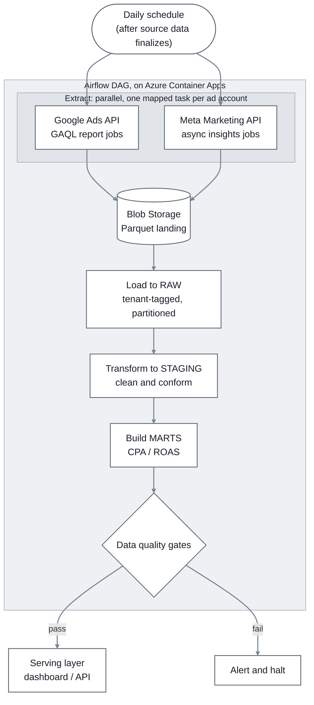

# Part 3 — Data Engineering

## 1. Overview & Problem Framing

### 1.1 What this pipeline does

A daily batch pipeline that pulls paid-media performance for every active campaign across Google Ads and Meta, lands it in the warehouse, and turns it into daily client-level CPA and ROAS marts with anomaly detection on top.

### 1.2 The scale it must handle

The brief assumes roughly **10,000 active Google Ads campaigns** and **20,000 active Meta DMA-campaigns** (Designated Market Area) each day. As §2.4 explains, at the campaign and DMA grain this is modest data volume; the real challenge is API rate limits, restatement, and reliability.

### 1.3 How it builds on Section 1

This pipeline is not a new system. It reuses the Section 1 architecture: Airflow runs on the existing Azure Container Apps environment, raw data lands in the existing Blob Storage zone, and everything flows into the existing Snowflake `RAW → STAGING → MARTS` warehouse.

## 2. Pipeline Architecture & Orchestration

**Decision:** Apache Airflow, self-hosted on the Azure Container Apps environment from Section 1, orchestrates the daily pipeline. The pipeline is ELT (extract, load, transform): extract from each API, land raw to Blob Storage, load to Snowflake, and transform in-warehouse.

### 2.1 Why Airflow on Container Apps

Part 1 §5.6 explicitly flagged orchestration as a portability risk: Azure Data Factory is the managed, Azure-native option, but it is Azure-only, and choosing it would couple the pipeline to one cloud. Airflow keeps that promise intact.

- **Portable.** Airflow runs as a container, so it moves to AWS or GCP with the rest of the platform. No orchestration logic is rewritten on a cloud migration.
- **Right ecosystem.** Airflow is Python-native (matching the stack) and has a mature operator and hook ecosystem for HTTP APIs and retries, which is most of what this pipeline does.
- **No new compute paradigm.** It runs on the Container Apps environment already provisioned in Section 1, and its metadata database is a schema on the operational Postgres, so it adds no new infrastructure category.
- **The trade-off we accept.** We operate Airflow (scheduler, workers, metadata DB) rather than consuming a managed service. For a pipeline of this size that is a modest cost, and it is the price of not coupling to Azure. Dagster was the other portable option and has a stronger data-quality story, but Airflow's ubiquity and operator ecosystem win for an API-extraction workload.

### 2.2 The end-to-end pipeline

The pipeline is **ELT**, not ETL (extract, transform, load): raw data is loaded first and transformed inside Snowflake. This preserves raw fidelity, makes every transform replayable from `RAW`, and pushes heavy compute onto the warehouse (Part 1 §3.5).

Each daily run, per platform:

1. **Extract.** Pull active-campaign reports from the Google Ads and Meta APIs.
2. **Land.** Write raw API responses to Blob Storage as Parquet, the landing zone from Section 1.
3. **Load.** `COPY` the Parquet into Snowflake `RAW`, tenant-tagged and date-partitioned.
4. **Transform.** Promote `RAW` to `STAGING` (clean, conform) and `STAGING` to `MARTS` (the CPA/ROAS tables of §9).
5. **Validate.** Data quality gates run before marts are published (§7).
6. **Publish.** Validated marts become the serving source for the dashboard and API.



### 2.3 DAG design and scheduling

- **One daily DAG** (directed acyclic graph, Airflow's term for a workflow), scheduled to run after both platforms have finalized the prior day's data.
- **Two parallel extract branches**, Google Ads and Meta, which are independent and run concurrently. They converge at the transform stage, because the CPA/ROAS marts need both.
- **Trailing-window re-pull.** Google Ads and Meta both restate metrics (especially conversions) for several days after the fact. The DAG re-pulls a trailing window (the last 3 to 7 days), not just yesterday. Because loads are idempotent by date partition (§3), re-pulling a day safely replaces it rather than duplicating it.

### 2.4 Absorbing the scale

The brief assumes ~10,000 active Google Ads campaigns and ~20,000 active Meta DMA-campaigns per day. The key design point: **never query per campaign.**

- **Google Ads.** GAQL reports are requested at the account (customer) level and return every campaign's rows in one paginated response. ~10k campaigns become one report job per client account, not 10k calls.
- **Meta.** The Insights API is queried per ad account with a DMA breakdown, returning all DMA-campaign rows for that account. ~20k DMA-campaigns become breakdown rows across a handful of report jobs.
- **Parallelism.** Extraction fans out with Airflow dynamic task mapping, one mapped task per ad account, bounded by an Airflow pool so concurrency respects each API's rate limits (§4, §5).
- **Perspective.** At the campaign and DMA grain this is roughly tens of thousands of rows per day. That is small data. The real engineering challenge here is API rate limits, restatement, and reliability, not data volume, and the design above targets exactly those.

## 3. Storage & Data Modeling

The three brief schemas (Google Ads, Meta Ads, Client Table) flow through the `RAW → STAGING → MARTS` layers established in Part 1 §3.5.

GA4 traffic data also lands in Snowflake via the export path described in Part 1 §3; its staging shape (a derived sessions / events / conversions model) is out of scope for Part 3 because the brief's Section 3 schemas are the paid-media ones.

### 3.1 The three layers, applied here

- **`RAW`.** Exactly what the APIs returned, stored as semi-structured `VARIANT` columns alongside metadata (`tenant_id`, `source`, `extracted_at`, `load_batch_id`). Append-only and date-partitioned. Storing the response verbatim is schema-on-read: it absorbs upstream schema drift without breaking ingestion (§6).
- **`STAGING`.** The raw responses parsed into typed, conformed, deduplicated tables, one row per campaign per day. This is where the brief's Google Ads and Meta schemas become real tables.
- **`MARTS`.** The business tables: the daily client-level CPA and ROAS tables, built in §9.

### 3.2 Staging table models

The brief's Google Ads and Meta schemas, plus a `tenant_id` (Part 1 §2.5) and a load timestamp:

```sql
-- Google Ads, one row per campaign per day
CREATE TABLE staging.stg_google_ads (
    tenant_id        STRING        NOT NULL,
    campaign_id      STRING        NOT NULL,
    campaign_type    STRING,
    date             DATE          NOT NULL,
    spend            NUMBER(18,2),
    impressions      NUMBER(18,0),
    clicks           NUMBER(18,0),
    conversions      NUMBER(18,2),
    loaded_at        TIMESTAMP_NTZ NOT NULL
);

-- Meta Ads, one row per DMA-campaign per day
CREATE TABLE staging.stg_meta_ads (
    tenant_id        STRING        NOT NULL,
    campaign_name    STRING        NOT NULL,
    dma              STRING        NOT NULL,
    day              DATE          NOT NULL,
    spend            NUMBER(18,2),
    reach            NUMBER(18,0),
    impressions      NUMBER(18,0),
    clicks           NUMBER(18,0),
    result_type      STRING,
    results          NUMBER(18,2),
    loaded_at        TIMESTAMP_NTZ NOT NULL
);
```

### 3.3 The Client table and the join model

`dim_client` is a **replicated table**, not the system of record. The source of truth is the operational store's `tenants` and `tenant_integrations` (Part 1 §2.5); a daily Airflow task refreshes the Snowflake copy so paid-media data can be joined to clients within one engine.

```sql
CREATE TABLE staging.dim_client (
    client_id                        STRING NOT NULL,  -- also the tenant_id
    client_name                      STRING NOT NULL,
    ga_campaign_id                   STRING,           -- joins to stg_google_ads.campaign_id
    meta_campaign_name               STRING,           -- joins to stg_meta_ads.campaign_name
    expected_revenue_from_acquisition NUMBER(18,2)      -- revenue per conversion, used for ROAS
);
```

Join paths used by the CPA/ROAS SQL (§9):

- **Google Ads → client:** `stg_google_ads.campaign_id = dim_client.ga_campaign_id`
- **Meta → client:** `stg_meta_ads.campaign_name = dim_client.meta_campaign_name`

**Data-modeling note.** The brief's Client Table has a single `GA Campaign_id` and `Meta Campaign Name` per client, implying one campaign per client per platform. At the Section 3 scale (~10k Google Ads campaigns) that 1:1 mapping is impossible, so we treat `dim_client` as a **campaign-to-client mapping**: a client may have multiple rows, one per campaign per platform. The CPA/ROAS SQL aggregates across them. If the brief meant the literal 1:1 reading, the same SQL still works.

### 3.4 Partitioning and idempotency

- `RAW` and `STAGING` tables are clustered by date, so a daily run scans only the partitions it touches.
- **Loads are idempotent by date partition.** Each `(source, date)` partition is fully replaced on re-run, not appended. This is what makes the trailing-window re-pull from §2.3 safe: re-pulling the last seven days overwrites those seven partitions rather than duplicating rows.
- The natural keys used for replacement and deduplication: `(tenant_id, campaign_id, date)` for Google Ads, and `(tenant_id, campaign_name, dma, day)` for Meta.

## 4. Google Ads API Connection

### 4.1 Authentication and access

Connecting to the Google Ads API requires several pieces:

- A **Google Ads manager account** (MCC) linked to the client accounts whose data is pulled.
- A **Google Cloud project** with the Google Ads API enabled.
- **OAuth2 credentials** (client ID and secret) and a long-lived **refresh token** for the service identity.
- A **developer token**, issued against the manager account.

The developer token has three access tiers: **test** (test accounts only, no real data), **basic** (limited daily operations), and **standard** (production scale). Pulling daily reports for ~10k campaigns requires **standard access**, which Google grants through an application review. The connection's credentials are stored in Key Vault (Section 1) and loaded by the Airflow extract task at runtime.

The **manager-account model** is what makes the scale tractable: you authenticate once at the MCC and then query each linked client account by its customer ID. The official `google-ads` Python client wraps the auth and request flow.

### 4.2 The query model: GAQL

Google Ads reporting uses **GAQL** (Google Ads Query Language), a SQL-like language. A query selects fields from a resource such as `campaign`; metrics and segments are also fields. Queries are issued through `GoogleAdsService.SearchStream`, which streams large result sets so no manual page cursor is needed.

### 4.3 Example query

The brief's Google Ads schema is `Campaign_id, Campaign_type, Date, Spend, Impressions, Clicks, Conversions`. This GAQL query returns exactly those columns, for active campaigns, over a date range:

```sql
SELECT
  campaign.id,
  campaign.advertising_channel_type,
  segments.date,
  metrics.cost_micros,
  metrics.impressions,
  metrics.clicks,
  metrics.conversions
FROM campaign
WHERE segments.date BETWEEN '2026-05-15' AND '2026-05-21'
  AND campaign.status = 'ENABLED'
```

Field mapping to the brief schema:

| Brief column | GAQL field | Note |
|--------------|------------|------|
| Campaign_id | `campaign.id` | |
| Campaign_type | `campaign.advertising_channel_type` | `SEARCH`, `DISPLAY`, `PERFORMANCE_MAX`, etc. |
| Date | `segments.date` | |
| Spend | `metrics.cost_micros` | **Returned in micros: divide by 1,000,000** to get account currency |
| Impressions | `metrics.impressions` | |
| Clicks | `metrics.clicks` | |
| Conversions | `metrics.conversions` | |

Two details that matter in practice:

- **`cost_micros`.** Google Ads returns spend in micros (millionths of the account currency unit). The load step divides by 1,000,000. Missing this is a classic and silent error.
- **`campaign.status = 'ENABLED'`** restricts the report to active campaigns, as the brief requires.

### 4.4 Scale, batching, and rate limits

- **Query at the account level, not per campaign.** One query against a customer account returns every campaign's daily rows. ~10k campaigns become one query per client account, run for the trailing window (§2.3).
- **`SearchStream`** streams large responses, so there is no per-page handling even for big accounts.
- **Rate limits** are enforced per developer token, as a daily operation quota tied to the access tier and as a concurrency limit. Standard access comfortably covers a per-account daily pull plus the trailing-window re-pull.
- **Parallelism** is bounded by an Airflow pool (§2.4): one mapped extract task per account, with concurrency capped so the pipeline stays inside the rate limits. Transient errors and quota responses are retried per §6.

## 5. Meta API Connection

Meta's Marketing API is structurally messier than Google Ads: reporting runs as asynchronous jobs, results are split by breakdown rows, and the metric the brief calls "Results" is not a plain field. This section covers each of those.

### 5.1 Authentication and access

Connecting to the Meta Marketing API requires:

- A **Meta app** registered in Meta for Developers, with the Marketing API product enabled.
- A **System User** in Meta Business Manager holding a long-lived access token. System-user tokens are the right choice because, unlike user tokens, they do not expire on a fixed cycle.
- The **ad account IDs** (`act_<id>`) for each client.
- **App Review.** Production-scale reporting needs the `ads_read` permission at advanced access, which Meta grants through App Review.

The token is stored in Key Vault (Section 1) and loaded by the Airflow extract task. The official `facebook-business` Python SDK (software development kit) wraps the API.

### 5.2 The query model: the Insights endpoint and async jobs

Meta reporting comes from the **Insights endpoint** (`/act_<id>/insights`). For anything beyond a trivial result set, Meta requires an **asynchronous report job**:

1. **Submit.** `POST` to the Insights endpoint creates a report run and returns a `report_run_id`.
2. **Poll.** `GET /<report_run_id>` until `async_status` is `Job Completed`.
3. **Fetch.** `GET /<report_run_id>/insights` returns the results, cursor-paginated.

Synchronous calls time out at this scale, so the async flow is the supported path. In Airflow, the poll step uses a deferrable operator so a worker is not held idle while Meta processes the job.

### 5.3 The DMA breakdown

The brief's Meta schema has a `DMA` column. Meta produces it through `breakdowns=dma`, which splits each campaign's metrics by Designated Market Area. This is also the source of the brief's "~20,000 Meta DMA-campaigns": a campaign targeted across many DMAs yields one row per DMA, so the row count is campaigns multiplied by their DMAs.

### 5.4 Example query

The brief's Meta schema is `Campaign name, DMA, Day, Spend, Reach, Impressions, Clicks, Result Type, Results`. This async Insights request returns those columns for active campaigns:

```
POST /act_<AD_ACCOUNT_ID>/insights
  level         = campaign
  breakdowns    = dma
  time_range    = {"since":"2026-05-15","until":"2026-05-21"}
  time_increment = 1
  fields        = campaign_name,spend,reach,impressions,clicks,actions
  filtering     = [{"field":"campaign.effective_status",
                    "operator":"IN","value":["ACTIVE"]}]
```

Field mapping to the brief schema:

| Brief column | Insights source | Note |
|--------------|-----------------|------|
| Campaign name | `campaign_name` | |
| DMA | `dma` breakdown | One row per DMA |
| Day | `date_start` | `time_increment=1` yields one row per day |
| Spend | `spend` | |
| Reach | `reach` | |
| Impressions | `impressions` | |
| Clicks | `clicks` | |
| Result Type | derived from `actions` | The optimized action type, e.g. `offsite_conversion`, `lead`, `link_click` |
| Results | derived from `actions` | The count for that action type |

The detail that catches people: **`Result Type` and `Results` are not plain fields.** Meta returns an `actions` array, a list of action-type/value objects. "Results" is the value for whichever action matches the campaign's optimization goal, and "Result Type" is that goal. The load step parses the `actions` array to flatten these two columns out, rather than selecting them directly.

`campaign.effective_status IN ['ACTIVE']` restricts the report to active campaigns, as the brief requires.

### 5.5 Scale and rate limits

- **One async job per ad account**, never per campaign. A single job with the DMA breakdown returns all of that account's campaign-by-DMA rows. The ~20k DMA-campaign rows arrive across a handful of accounts.
- **Rate limiting** on Meta is score-based: the API throttles by a per-app and per-account load score, and large async jobs are the sanctioned way to stay under it rather than many small calls.
- **Async jobs can be slow**, sometimes minutes for a large account. The trailing-window re-pull (§2.3) and the SLAs (§8) account for this latency.
- **Parallelism** is bounded by an Airflow pool, one mapped extract task per ad account, with the poll-and-fetch handled by deferrable operators.

## 6. Exception Handling & Retries

A daily pipeline talking to two third-party APIs will fail regularly. The design treats failure as routine, not exceptional, and handles each class of failure differently.

### 6.1 Failure classes and responses

| Failure | Example | Response |
|---------|---------|----------|
| Transient API error | 5xx, connection timeout | Retry with exponential backoff |
| Rate limiting | HTTP 429, Meta throttle score | Retry with longer backoff, honor `Retry-After` |
| Auth failure | Expired or revoked token | Fail fast and alert; retries cannot fix it |
| Partial failure | One ad account fails, the rest succeed | Isolate per account; the failed account retries alone |
| Schema drift | API adds or renames a field | Absorbed by the `RAW` `VARIANT` layer; staging validation catches it |
| Bad record | Malformed row, null in a required field | Quarantine the row, continue the run |

### 6.2 Retries and backoff

- **Task-level retries.** Each Airflow task retries with exponential backoff, so a brief API outage resolves itself without intervention.
- **Call-level retries.** Inside the extract code, individual API calls retry with backoff (for example via `tenacity`), honoring `Retry-After` on rate-limit responses.
- **Bounded.** After a retry budget is exhausted the task fails loudly rather than retrying forever, which hands the problem to alerting (§6.5).

### 6.3 Idempotent reruns

Because loads replace a date partition rather than appending (§3.4), **any task can be safely re-run**. A retried extract, a manually re-triggered day, or the trailing-window re-pull all converge to the same result. Idempotency is what makes aggressive retrying safe.

### 6.4 Isolation and dead-lettering

- **Per-account isolation.** Extraction is one mapped task per ad account (§2.4), so one client's failure does not block the other clients' data.
- **Dead-letter table.** Records that fail validation are written to a reject table with the failure reason and the source batch ID, rather than silently dropped or aborting the run. They can be inspected and replayed once the cause is fixed.
- **Circuit breaking.** If an API is fully unavailable, the pipeline fails fast for that source instead of hammering it and burning the retry budget.

### 6.5 Alerting

Failures surface through the Part 1 §8 monitoring strategy. Alerts are routed to the team's Slack channel (or an email distribution list), tagged by severity so a missed data-freshness SLA is distinguishable from a recovered-after-retry blip or a non-empty dead-letter table.

## 7. Testing Strategy

The pipeline is tested at four levels, because a bug in a transform and a silent data-quality regression are different problems that need different checks.

### 7.1 Unit tests

The transform logic, tested in isolation with fixed inputs: the `cost_micros` conversion (§4.3), the parsing of Meta's `actions` array into Result Type and Results (§5.4), deduplication, and type coercion. These are pure functions and fast to test exhaustively, including the edge cases (zero conversions, missing action types).

### 7.2 Schema and contract tests

The API responses are validated against an expected shape before they are trusted. The connectors pin a specific API version, and a contract test fails the build if a response no longer matches the expected schema. This turns an upstream API change into a caught test failure rather than a production data corruption.

### 7.3 Data quality tests

Run against the data itself, after load, as the gate before marts are published (the `dq` step in §2.2):

- **Volume:** row counts are within an expected range for the day, catching a partial extract.
- **Completeness:** null rates on required fields stay within bounds.
- **Validity:** values are in plausible ranges (no negative spend, clicks not exceeding impressions).
- **Referential integrity:** every campaign maps to a client in `dim_client`.
- **Freshness:** the latest data is for the expected date.

A failed gate halts publication and alerts, so bad data never reaches the dashboard. These checks are expressed with a declarative tool such as dbt tests, Great Expectations, or Soda.

### 7.4 Integration and DAG tests

- **Integration tests** run the connectors against recorded API fixtures and against the platforms' sandbox accounts (the Google Ads test account and the Meta sandbox account from the Section 3 design), exercising the real request and pagination flow without real data.
- **DAG tests** confirm the Airflow DAG parses, has no cycles, and has valid task dependencies.

### 7.5 Continuous-integration (CI) integration

Unit, schema, and DAG tests run on every pull request. Data quality tests run in the pipeline itself on every scheduled run, since they validate live data, not code. A change cannot merge with failing tests.

## 8. SLAs

The pipeline makes four commitments. Each is measurable, and each is monitored through the Part 1 §8 observability strategy.

| SLA | Target | Measurement |
|-----|--------|-------------|
| **Data freshness** | Day `D` marts available by 08:00 on day `D+1` | Timestamp of the latest successful marts build |
| **Success rate** | 99% of scheduled runs complete without manual intervention | Successful runs over total runs, trailing 30 days |
| **Runtime** | A daily run finishes within its time budget (for example 2 hours) | DAG run duration |
| **Recovery Time Objective (RTO)** | A failed run is recovered within 4 hours of its scheduled completion | Time from failure to a successful re-run |

A few notes on why these targets:

- **Freshness is the SLA that matters most.** For an analytics product, data that is correct but late is still a failure: the morning dashboard must be ready before the client's working day. The 08:00 target leaves room to detect and recover an overnight failure within the RTO.
- **Restatement is designed for, not fought.** Google Ads and Meta revise metrics for several days, so the trailing-window re-pull (§2.3) re-states recent days automatically. "Freshness" therefore means the latest day is present and recent days are kept current, not that data never changes.
- **The targets are illustrative.** Real numbers would be set with the business against the cost of meeting them. The point is that each SLA is defined as a specific, monitored signal rather than a vague promise.

## 9. CPA & ROAS SQL

### 9.1 The two metrics

- **CPA (cost per acquisition)** = total spend / total conversions.
- **ROAS (return on ad spend)** = total revenue / total spend, where revenue is modeled as `conversions x expected_revenue_from_acquisition` from the Client table.

Both are computed at the **client-day grain**, combining Google Ads and Meta spend.

### 9.2 One mart, not two

CPA and ROAS share the same grain and the same underlying aggregation: total spend and total conversions per client per day. Building two separate tables would duplicate that join-and-aggregate work and risk the two drifting apart. The SQL below builds a **single** `mart_client_daily_performance` table carrying both metrics. If the brief's "CPA and ROAS tables" must be literally separate objects, two trivial views over this table satisfy that without recomputation.

### 9.3 The SQL

```sql
-- =====================================================================
-- marts.mart_client_daily_performance
-- Daily client-level CPA and ROAS, combining Google Ads and Meta spend.
-- Grain: one row per (client_id, activity_date).
-- =====================================================================
CREATE OR REPLACE TABLE marts.mart_client_daily_performance AS

WITH
-- Meta result_type values that count as an acquisition. Meta reports many
-- action types; only conversion-style goals are acquisitions for CPA/ROAS.
meta_conversion_types AS (
    SELECT column1 AS result_type
    FROM VALUES ('offsite_conversion'), ('onsite_conversion'), ('lead')
),

-- One row per client. dim_client may hold several campaign-mapping rows
-- per client (see §3.3), so collapse to a distinct client dimension.
client_dim AS (
    SELECT DISTINCT
        client_id,
        client_name,
        expected_revenue_from_acquisition
    FROM staging.dim_client
),

-- Google Ads: attribute each campaign-day to its client.
google_daily AS (
    SELECT
        c.client_id,
        g.date           AS activity_date,
        g.spend          AS spend,
        g.conversions    AS conversions
    FROM staging.stg_google_ads g
    JOIN staging.dim_client c
      ON g.campaign_id = c.ga_campaign_id
     AND g.tenant_id   = c.client_id
),

-- Meta: roll DMA rows up to campaign-day, attribute to client, and
-- count only conversion-type results as conversions.
meta_daily AS (
    SELECT
        c.client_id,
        m.day            AS activity_date,
        m.spend          AS spend,
        CASE
            WHEN m.result_type IN (SELECT result_type FROM meta_conversion_types)
            THEN m.results
            ELSE 0
        END              AS conversions
    FROM staging.stg_meta_ads m
    JOIN staging.dim_client c
      ON m.campaign_name = c.meta_campaign_name
     AND m.tenant_id     = c.client_id
),

-- Common grain across both platforms.
combined AS (
    SELECT client_id, activity_date, spend, conversions FROM google_daily
    UNION ALL
    SELECT client_id, activity_date, spend, conversions FROM meta_daily
),

-- Aggregate to client-day.
client_daily AS (
    SELECT
        client_id,
        activity_date,
        SUM(spend)        AS total_spend,
        SUM(conversions)  AS total_conversions
    FROM combined
    GROUP BY client_id, activity_date
)

SELECT
    cd.client_id,
    d.client_name,
    cd.activity_date,
    cd.total_spend,
    cd.total_conversions,
    d.expected_revenue_from_acquisition,
    cd.total_conversions * d.expected_revenue_from_acquisition
                                              AS total_revenue,
    -- CPA: NULL when there are no conversions (no division by zero).
    cd.total_spend / NULLIF(cd.total_conversions, 0)
                                              AS cpa,
    -- ROAS: NULL when there is no spend.
    (cd.total_conversions * d.expected_revenue_from_acquisition)
        / NULLIF(cd.total_spend, 0)           AS roas
FROM client_daily cd
JOIN client_dim d
  ON cd.client_id = d.client_id;
```

### 9.4 Notes on the SQL

- **The joins** follow the model in §3.3: Google Ads joins to the client on `campaign_id = ga_campaign_id`, Meta on `campaign_name = meta_campaign_name`. Both also match `tenant_id = client_id` so the join cannot cross a tenant boundary.
- **Meta conversions (assumption).** Meta's `results` is only an acquisition when `result_type` is a conversion goal. The `meta_conversion_types` list makes that assumption explicit and easy to adjust; non-conversion results contribute spend but not conversions.
- **Revenue** is modeled as `conversions x expected_revenue_from_acquisition`, the only revenue input the brief's schemas provide.
- **`NULLIF` guards both divisions.** A client with spend but zero conversions yields a `NULL` CPA rather than an error. That is also a meaningful signal, and §10 treats it as an anomaly.
- **GA4 not present.** CPA and ROAS are paid-media metrics by definition (spend ÷ acquisitions, both from the ad platforms). GA4 contributes traffic data — sessions, users, page views — which would feed a separate traffic mart, not this one. The architectural acknowledgment is in §3.

## 10. Anomaly Detection SQL

### 10.1 Approach

An anomaly is a client-day that departs from that client's own recent history. Each client has a different normal, so the detection is **per client** and **relative to a trailing window**, not against a global threshold.

The SQL combines two kinds of check:

- **Statistical.** A z-score: how many standard deviations a day's CPA or ROAS sits from that client's trailing 28-day mean. A z-score past ±3 is flagged.
- **Rule-based.** Conditions that are anomalous regardless of distribution: spend with zero conversions, or spend several times the trailing average.

### 10.2 The SQL

```sql
-- =====================================================================
-- marts.mart_client_daily_anomalies
-- Flags anomalies in the daily client-level CPA/ROAS data by comparing
-- each client-day against that client's trailing 28-day history.
-- =====================================================================
CREATE OR REPLACE TABLE marts.mart_client_daily_anomalies AS

WITH stats AS (
    SELECT
        client_id,
        client_name,
        activity_date,
        total_spend,
        total_conversions,
        cpa,
        roas,
        -- Trailing 28 days, current day excluded.
        AVG(cpa)         OVER w AS cpa_mean,
        STDDEV(cpa)      OVER w AS cpa_std,
        AVG(roas)        OVER w AS roas_mean,
        STDDEV(roas)     OVER w AS roas_std,
        AVG(total_spend) OVER w AS spend_mean
    FROM marts.mart_client_daily_performance
    WINDOW w AS (
        PARTITION BY client_id
        ORDER BY activity_date
        ROWS BETWEEN 28 PRECEDING AND 1 PRECEDING
    )
),

scored AS (
    SELECT
        stats.*,
        (cpa  - cpa_mean)  / NULLIF(cpa_std, 0)  AS cpa_zscore,
        (roas - roas_mean) / NULLIF(roas_std, 0) AS roas_zscore
    FROM stats
)

SELECT
    client_id,
    client_name,
    activity_date,
    total_spend,
    total_conversions,
    cpa,
    roas,
    cpa_zscore,
    roas_zscore,
    -- Individual anomaly flags
    (total_spend > 0 AND total_conversions = 0) AS is_zero_conversions_with_spend,
    (cpa_zscore  >  3)                          AS is_cpa_spike,
    (roas_zscore < -3)                          AS is_roas_collapse,
    (total_spend > 3 * spend_mean)              AS is_spend_spike
FROM scored
WHERE (total_spend > 0 AND total_conversions = 0)
   OR cpa_zscore  >  3
   OR roas_zscore < -3
   OR total_spend > 3 * spend_mean;
```

### 10.3 What each flag catches

| Flag | Condition | Why it matters |
|------|-----------|----------------|
| `is_zero_conversions_with_spend` | Spend > 0, conversions = 0 | Money spent with nothing to show; often broken tracking or a misconfigured campaign |
| `is_cpa_spike` | CPA z-score > 3 | Acquisition cost has jumped well above the client's norm |
| `is_roas_collapse` | ROAS z-score < -3 | Return on spend has fallen sharply |
| `is_spend_spike` | Spend > 3x the trailing mean | Possible runaway budget or a pacing error |

### 10.4 Notes and refinements

- **Direction matters.** CPA is flagged only when it spikes *up* (`> 3`) and ROAS only when it collapses *down* (`< -3`); a cheaper CPA or a higher ROAS is good news, not an anomaly.
- **The window excludes the current day** (`1 PRECEDING`), so a day is never compared against itself.
- **Thresholds are deliberately simple.** The ±3 sigma cutoff and the 3x spend multiple are configurable starting points. They would be tuned against real alert volume.
- **Early history.** A client with fewer than a couple of weeks of data has an unstable standard deviation, so its z-scores are unreliable. A production version would suppress statistical flags until a minimum history exists; the rule-based flags work from day one.
- **The SQL is standard.** Window functions, `STDDEV`, and `NULLIF` are portable across Snowflake and Postgres, consistent with the Part 1 §4.3 commitment to keep the marts engine-agnostic.

## 11. Summary

### 11.1 The pipeline in brief

A daily Airflow pipeline, hosted on the Section 1 Container Apps environment, extracts active-campaign reports from the Google Ads and Meta APIs at the account level, lands them as Parquet, and loads them into Snowflake (§2). Data flows through `RAW → STAGING → MARTS`, with the brief's three schemas modeled as typed staging tables and partition-replace idempotency (§3). The API connections are documented with example queries that return exactly the brief's schemas (§4, §5). Failure is treated as routine, with typed retries, isolation, and dead-lettering (§6); the pipeline is tested at four levels (§7) and holds four measurable SLAs (§8). The CPA/ROAS marts (§9) and the anomaly detection on top of them (§10) are written as standard, portable SQL.

### 11.2 Requirements coverage

| Requirement | Addressed in |
|-------------|--------------|
| FR-3.1 Cloud pipeline, daily Google Ads + Meta ingest | §2 |
| FR-3.2 Orchestration | §2 |
| FR-3.3 Storage | §3 |
| FR-3.4 Exception handling | §6 |
| FR-3.5 Testing | §7 |
| FR-3.6 API connection documentation | §4, §5 |
| FR-3.7 Example queries | §4, §5 |
| FR-3.8 Daily client-level CPA SQL | §9 |
| FR-3.9 Daily client-level ROAS SQL | §9 |
| FR-3.10 Anomaly detection SQL | §10 |
| NFR-3 Scale (~10k/20k campaigns) | §2.4, §4.4, §5.5 |
| NFR-4 SLAs | §8 |
| NFR-11 Resilience | §6 |
| NFR-12 Testability | §7 |

---

## Decision Log

| Area | Decision | Reasoning |
|------|----------|-----------|
| Orchestrator | Apache Airflow on Azure Container Apps | _§2_ |
| Storage layers | RAW → STAGING → MARTS in Snowflake | _§3_ |
| Idempotency | Re-run replaces a date partition | _§3, §6_ |
