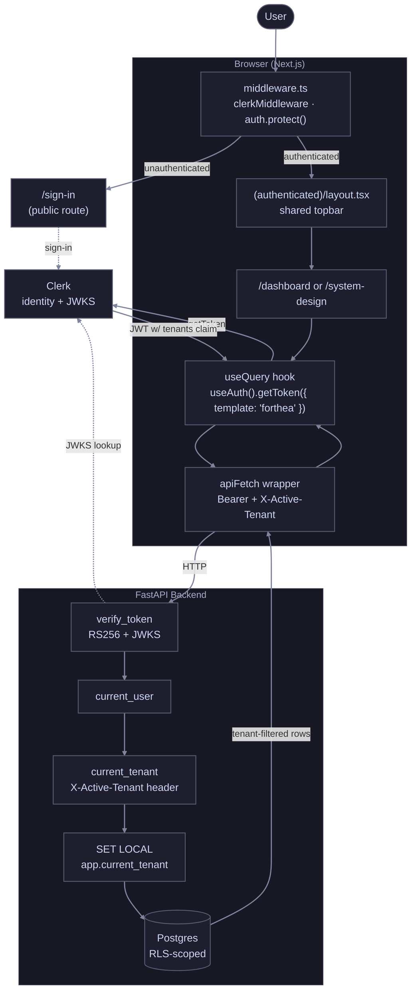

# Part 4: Frontend (Next.js Dashboard)

## 1. Overview

### 1.1 What this app is

The agency's daily interface: a Next.js dashboard that reads the Part 2
backend, renders marketing performance for the active client, and lets
operators upload fresh JSON files through a guided async flow. Also hosts
the rendered design docs at `/system-design` so a reviewer can read every
part of the system without leaving the running app.

### 1.2 What this app is not

- **Not the analytical engine.** Aggregations and joins live in Snowflake
  (Part 1 §4) and reach the dashboard through Part 2's mart-shaped
  endpoints. The frontend computes KPI totals from a window of mart rows;
  it never joins paid-media sources at query time.
- **Not the system of record for tenant identity.** Clerk owns user records
  and the per-user `publicMetadata.tenants` claim. The dashboard reads them
  and resolves the active tenant per request; it never mutates them.
- **Not a real BI tool.** The chart catalogue is deliberately small (CPA,
  ROAS, macro overlay, anomaly callouts), sized to the brief, not to an
  arbitrary self-serve product surface.

### 1.3 How it connects to the rest of the system

- **Backend (Part 2)** for all marketing data, anomalies, FRED proxy, and
  upload orchestration. The dashboard never calls FRED directly.
- **Clerk** for identity and JWT issuance; the same JWT carries the
  tenant claim the backend verifies.
- **Azure Container Apps** in production (Part 1 §5.2); local dev runs the
  Next.js dev server against the FastAPI container on `localhost:8000`.

### 1.4 The two surfaces

- **`/dashboard`**: KPI strip + CPA / ROAS charts + macro chart +
  anomalies panel + performance table. Every panel is tenant-scoped.
- **`/system-design`**: every design doc in the repo, rendered in-app
  with diagrams, syntax highlighting, and tables. Visible from the same
  topbar via a segmented `Dashboard | System design` control.

Both routes share one layout (`app/(authenticated)/layout.tsx`) which
hosts the tenant selector, view toggle, and Clerk user button. The
`(authenticated)` is a Next.js route group: invisible in URLs, used purely
to share layout state between the two top-level views.

## 2. Auth & Tenant Flow

**Decision:** Clerk-hosted identity, JWT verified backend-side via JWKS,
tenant context propagated through a per-request header and enforced at the
database via Postgres RLS (defense-in-depth with Part 2 §6).

### 2.1 Why Clerk

Already chosen in Part 2 §1.5; the frontend just consumes it. Clerk's
Next.js SDK ships `<ClerkProvider>`, the `useAuth` / `useUser` hooks, a
`<UserButton>` widget, and the `clerkMiddleware` that gates routes, every
auth surface we need without writing one ourselves. Auth0 would be a
mechanical swap (validate JWT, read claims); we picked Clerk for the
Next.js polish and free-tier coverage.

### 2.2 The flow end-to-end



Three things the diagram makes explicit:

1. **Middleware gates everything.** `clerkMiddleware` runs on every request
   before any page code executes. Unauthenticated users are redirected to
   `/sign-in` (the one public route) before the dashboard even tries to
   render.
2. **The JWT carries tenant context.** The `forthea` JWT template (§2.4)
   embeds `tenants` from the user's `publicMetadata`. Backend reads it
   without needing a follow-up DB lookup.
3. **Defense in depth.** The bearer token, the active-tenant header, and
   the database's RLS policy are three independent enforcement points. Any
   one of them failing closed is enough to keep tenant data isolated.

### 2.3 The JWT template

The backend (Part 2 §1.5, `app/auth/clerk.py`) only accepts tokens
rendered through the `forthea` template. A plain Clerk session token is
missing the tenant claim and would fail the strict check. The frontend
asks for the template by name on every call:

```ts
// lib/queries.ts (excerpt)
const token = await getToken({ template: "forthea" });
```

The template lives in Clerk's dashboard with these claims:

```json
{
  "tenant_id": "{{user.public_metadata.tenant_id}}",
  "tenants":   "{{user.public_metadata.tenants}}",
  "email":     "{{user.primary_email_address.email_address}}"
}
```

`tenants` is a JSON array (`["apple", "google", "disney"]` for agency
staff; `["apple"]` for a single-tenant client). The backend treats `tenants`
as authoritative and uses `tenant_id` only as a fallback for single-tenant
users.

### 2.4 The middleware

```ts
// middleware.ts (excerpt)
const isPublicRoute = createRouteMatcher(["/sign-in(.*)"]);

export default clerkMiddleware(async (auth, req) => {
  if (!isPublicRoute(req)) {
    await auth.protect();
  }
});
```

- Every route except `/sign-in(.*)` requires an authenticated session.
- `auth.protect()` short-circuits with a 307 to the sign-in page when the
  session is missing or expired.
- Sits ahead of every page render, so no client-side flash of unauthenticated
  content.

The matcher config excludes Next.js internals (`_next`, static assets) so
the middleware doesn't run on every image/font request.

> **Note:** Next.js 16 deprecates `middleware.ts` in favour of `proxy.ts`,
> but Clerk's SDK 7.4.x still ships `clerkMiddleware` under the middleware
> convention. We swap to `proxy.ts` once Clerk publishes official Next 16
> proxy guidance; until then, the deprecation is non-breaking.

### 2.5 Tenant resolution (the URL + header dance)

The brief models two user types:

- **External clients**: `publicMetadata.tenants` has one entry. They're
  pinned to that tenant; the topbar shows a read-only chip.
- **Agency staff**: `publicMetadata.tenants` has many entries. They get a
  dropdown in the topbar to switch the active tenant.

The active tenant lives in the URL as `?tenant=apple`. The pattern:

1. **TenantSelector writes the URL** when the user picks a tenant
   (`router.push(`${pathname}?tenant=apple`)`).
2. **`useActiveTenant()`** (lib/use-active-tenant.ts) reads the URL,
   intersects it against the user's allowed tenants from Clerk's
   metadata, and returns `{ active, tenants, isReady, isMultiTenant }`.
   The URL value is never trusted unconditionally; it must match an entry
   in the metadata's `tenants` claim or the hook falls back to
   `tenants[0]`.
3. **API hooks gate on `isReady && !!active`** so no query fires before
   tenant resolution is settled. Prevents a flash of "no data" or a 400
   from the backend asking for the missing header.
4. **`apiFetch` includes the `X-Active-Tenant` header** when an active
   tenant is set. Backend's `current_tenant` dependency validates the
   header against the token's `tenants` claim; a stray header for a
   tenant the user doesn't own returns 403.

URL-as-source-of-truth (rather than Zustand / React Context) means:
state survives refresh, is shareable, deep-linkable, and never needs a
provider hierarchy.

### 2.6 Why no global state library

Every piece of dashboard state has a natural home:

| State | Home | Why |
|---|---|---|
| Active tenant | URL `?tenant=` | Shareable, survives refresh, no provider tree |
| Time range | URL `?range=` | Same |
| Auth identity | Clerk's `useUser()` / `useAuth()` | Provided by `<ClerkProvider>` once at the root |
| Server cache | TanStack Query | Single QueryClient in `app/providers.tsx` |
| Transient UI (dropdowns, dialogs) | Local `useState` | Component-scoped, no need to lift |

A Redux / Zustand store would only carry redundant copies of the above. We
don't have any cross-cutting client state that's both ephemeral *and*
needs to be shared between distant components. The only candidate (active
tenant) is already in the URL.

## 3. Data Fetching Architecture

**Decision:** TanStack Query for every backend read, wrapped by a small
typed `apiFetch` that always uses the Clerk JWT and the active tenant.

### 3.1 The three layers

| Layer | File | Responsibility |
|---|---|---|
| HTTP wrapper | `lib/api.ts` | Build URL, attach Bearer + tenant header, parse FastAPI's error envelope, throw typed `ApiError`. Plain function, no React, no Clerk. |
| Authed fetcher | `lib/queries.ts` → `useAuthedFetcher` | React hook that grabs the Clerk token (`getToken({ template: "forthea" })`) and the active tenant, then calls `apiFetch`. Lives in one place because token acquisition is the only Clerk-aware step. |
| Query hooks | `lib/queries.ts` → `useMe`, `useClients`, … | Per-endpoint thin wrappers around `useQuery`. Each one keys its cache by `[endpoint, tenant, ...filters]`. |

Splitting these means the HTTP wrapper is testable in isolation, and the
Clerk dependency only touches one file. Adding a new endpoint = one
response type in `lib/api.ts`, one hook in `lib/queries.ts`.

### 3.2 Cache keying invalidates naturally on tenant switch

TanStack's cache is keyed by the query key array. Every tenant-scoped hook
puts the active tenant in its key:

```ts
queryKey: ["performance", active, filters]
```

Switching tenants writes a new value to the URL → `useActiveTenant`
returns a new `active` → query keys change → TanStack treats them as new
queries and refetches. The old tenant's data stays cached in case the user
switches back, but the UI never sees it for the wrong tenant.

No manual `invalidateQueries` is needed for the tenant switch case. Upload
success is the one place we do invalidate explicitly (§7.3), because the
mart contents changed underneath the cache key.

### 3.3 Errors are typed

`apiFetch` throws `ApiError` carrying `status` and the FastAPI `detail`
field. Hooks pass these straight through; components render them inline
(red-bordered card with the message). 4xx errors short-circuit retries;
auth or input errors won't fix themselves by trying again.

### 3.4 Initial render gating

Two signals determine whether a query is allowed to fire:

- `isReady`: Clerk's user object has loaded
- `!!active`: a tenant is resolved

Every tenant-scoped hook combines them as `enabled: isReady && !!active`,
so no query fires before tenant resolution settles. Without the gate, the
backend would see a request missing the `X-Active-Tenant` header and
return a 400.

Everything else is handled by TanStack's defaults: `staleTime: 60s` keeps
the dashboard quiet on tab focus, `refetchOnWindowFocus: false` avoids
surprising refetches. The performance table's Prev/Next buttons enable
themselves off the page's own `hasPrev` / `hasNext` derived state, not as
a query-level gate.

## 4. Component Architecture

**Decision:** A consistent "presenter + orchestrator" split per panel.
Presenters are pure visual components; orchestrators own the queries and
data shaping.

### 4.1 The pattern

| Presenter | Orchestrator | What the orchestrator does |
|---|---|---|
| `KpiCard` | `KpiStrip` | Fetches current + prior performance windows + macro; computes 7 KPIs and Δs; passes formatted strings to KpiCard |
| `LineChart` | `CpaChart`, `RoasChart`, `MacroChart` | Fetches /performance + /anomalies; aggregates per-day; supplies CPA / ROAS / macro-flavoured formatters |
| (self-contained) | `AnomaliesPanel`, `PerformanceTable`, `UploadData` | Owns both queries and rendering. No separate presenter because the visual is panel-specific and not reused. |

A presenter never imports `@/lib/queries`. An orchestrator never imports d3
or rendering primitives directly. This means: every visual is testable
without mocking queries, and every data-shaping decision lives next to the
endpoint it queries.

### 4.2 Folder layout

Inside the `(authenticated)/layout`, each route has a `_components/`
folder for its private components. The underscore prefix tells Next.js
the folder isn't a route. Shared topbar components (tenant selector, view
toggle) live in `(authenticated)/_components/` so both views consume
the same instances.

### 4.3 Concrete example: CpaChart

```ts
// CpaChart (orchestrator)
export function CpaChart() {
  const { window: w, days } = useRange();
  const performance = usePerformance({ start_date: w.start, end_date: w.end, ... });
  const anomalies   = useAnomalies({ ..., flag_type: "cpa_spike" });

  const series = useMemo(() => [{
    id: "cpa", label: "CPA", color: "var(--color-ctp-blue)",
    data: aggregateCpaByDay(performance.data?.items ?? []),
  }], [performance.data]);

  const markers = useMemo(
    () => (anomalies.data?.items ?? []).map(toMarker),
    [anomalies.data],
  );

  return (
    <section className="...">
      <header>…</header>
      <LineChart
        series={series}
        anomalies={markers}
        formatY={formatCpa}
        isLoading={performance.isLoading || anomalies.isLoading}
      />
    </section>
  );
}
```

Roughly 100 lines of orchestrator wraps a generic 300-line d3 presenter.
RoasChart and MacroChart are the same shape with different formatters and
anomaly filters; most of the duplication is the orchestrator's tooltip
copy and the panel chrome.

## 5. Charts (d3 + React)

**Decision:** React owns the DOM; d3 provides scales, line generators, and
the axis renderer. One reusable `LineChart` component used by every
time-series panel.

### 5.1 The React + d3 pattern

Two common patterns:

1. **d3 owns the DOM**: `d3.select(ref.current).attr(...)`. Fast, but
   fights React reconciliation; every re-render is awkward.
2. **React owns the DOM, d3 provides math**: d3 computes scales,
   generates `d` attributes for `<path>` elements, computes tick positions.
   React renders the SVG.

We use pattern 2 throughout. The one exception is the axis renderer:
`d3.axisBottom` / `d3.axisLeft` mutate a `<g>` element to produce tick
marks and labels. Re-implementing that layout in JSX is ~50 lines of
fiddly text-anchor math; we instead hand a `<g>` ref to d3 inside a small
`<D3Axis>` effect-component.

### 5.2 What `LineChart` does

- **Responsive width.** Wraps content in a `div` with `useElementWidth`
  (ResizeObserver hook) so the SVG re-renders when the container resizes.
  Skeletons show during the initial measurement so there's no blank flash.
- **Multi-series support.** `series: LineSeries[]`, built for future
  ROAS overlays we didn't end up needing; still useful because slice 3
  reuses it for ROAS and slice 4 for the macro chart.
- **Time × linear scales** with d3, `nice()`-rounded y-ticks, dashed
  gridlines drawn behind the line.
- **`.defined()` gaps.** Days with null CPA (zero conversions) cleanly
  break the line instead of stitching across zero.
- **Hover crosshair.** A transparent `<rect>` over the plot area captures
  mousemove; we snap to the nearest data point via `d3.bisector` and draw
  a vertical guide + per-series dots.
- **Anomaly markers.** Red dots overlaid on the line at the anomaly day.
  Hovering one switches the tooltip to the anomaly label
  (`cpa_spike (z=+3.2)`).
- **Tooltip outside the SVG.** Absolutely-positioned div in the chart
  container so we can use normal HTML for layout. Flips left/right
  depending on whether the right edge would overflow.
- **`yTickCount` prop.** Default 5 on the dashboard; the expanded-view
  modal passes 10 for a denser y-axis. Lets the same component drive both
  density settings without forking.

### 5.3 Loading shape

The chart's loading skeleton is *chart-shaped*: dashed horizontal
gridlines at the same insets the real chart uses, plus a pulsing label
centred in the plot area. When data arrives the layout doesn't jump
because the gridlines were already in the right positions.

### 5.4 Expanded view

Every chart panel (CPA, ROAS, Macro) and the anomalies panel ships with
an `ExpandButton` (Maximize2 icon) in its header. Click it and an
`<ExpandedPanel>` modal opens (5xl wide, Esc to dismiss) with:

- A 4-card stats row (Average / Min / Max / Data points), unit-formatted
  to match the metric
- A bigger 480px-tall chart with `yTickCount: 10` for denser axis labels
- Same hover crosshair + anomaly dots as the dashboard view

For the anomalies panel the modal swaps the chart for a flag-count summary
plus a responsive grid of every flagged client-day with every metric
exposed (spend, conversions, CPA, ROAS, both z-scores, all triggered
flags). One shared file (`expanded-panel.tsx`) exports
`<ExpandedPanel>` + `<ExpandButton>` + `<StatsRow>`; all four panels
import from the same place so the affordance is identical everywhere.

## 6. Time Range

**Decision:** Three-button segmented switcher (`7d / 30d / 90d`) in the
dashboard topbar, URL-backed via `?range=`, default `30d`.

`useRange()` reads the URL param, intersects with the allow-list, computes
a `DateWindow` (`{ start, end, priorStart, priorEnd }`) in UTC. The prior
window is the immediately preceding window of equal length, and every KPI
card's Δ vs prior uses this. UTC throughout because the backend's date
columns aren't timezone-aware.

Switching range writes a new value to the URL → every hook keyed on the
window refetches simultaneously (KPI strip's two `/performance` calls,
both charts, the macro chart, the anomalies panel, the table). One user
action, one wave of refetches.

## 7. Async Upload Flow

**Decision:** Mirror Part 2 §2.2's four-step async pattern inside a modal
dialog. State machine for the phases; TanStack invalidation on success.

### 7.1 The four phases

```
initiate → upload (PUT to presigned URL) → commit → poll until terminal
```

The dialog component is a small state machine:

```
idle → initiating → uploading → committing → polling → { succeeded | failed }
```

Each phase has its own sub-view; the "in flight" sub-views (initiating
through polling) render a step list with ✓ for done, pulsing blue for
active, and hollow for pending. The Close button is hidden and Escape is
suppressed while the upload is mid-flight to prevent accidental cancel
between PUT and commit (which would leave a half-written blob).

### 7.2 Local-vs-prod difference

In local dev the presigned URL points back at the backend's
`PUT /uploads/{id}/blob`, because the filesystem storage backend can't issue
real out-of-band URLs. In production it's an Azure SAS that bypasses the
backend. The frontend's PUT step doesn't know which world it's in; we
always attach the Authorization header (harmless on our PUT route, would
break a real SAS request). Comment in the file flags the prod swap as a
URL-origin check.

### 7.3 Cache invalidation

On success the dialog invalidates three TanStack query prefixes:

```ts
queryClient.invalidateQueries({ queryKey: ["performance"] });
queryClient.invalidateQueries({ queryKey: ["anomalies"] });
queryClient.invalidateQueries({ queryKey: ["clients"] });
```

These match every variant keyed under those prefixes (all windows, all
tenants), so the dashboard repaints with the new data without the user
needing to refresh. Macro stays cached; FRED doesn't change because we
uploaded a Google Ads file.

### 7.4 Polling ceiling

The poll loop caps at 60 attempts × 1s = 60s. If the worker takes longer
than that, the dialog flips to `failed` with "still processing after 60s.
Check the server." Caps are deliberately tight so a stuck upload
surfaces fast; the real worker should finish in <5s for typical files.

## 8. Error & Loading States

### 8.1 Two layers of error handling

- **Inline (per-panel).** Every panel's hook can fail (4xx / 5xx); the
  component renders a small red-bordered card with the message. This is
  the common case (a transient backend hiccup, a tenant with no data,
  etc.).
- **Render-time crashes (per-panel).** Each panel is wrapped in a class-
  based `<ErrorBoundary>` that catches React render exceptions (a
  formatter exploding on null, a useMemo over malformed data). The fallback
  is the same red-bordered card with a `Try again` button and a
  collapsible technical detail.
- **Route-level fallback.** `app/(authenticated)/dashboard/error.tsx`
  catches anything that escapes the per-panel boundaries (a crash in the
  layout itself, or in the page composition). Standard Next.js convention.

### 8.2 Loading skeletons

Each visual has a skeleton matched to its shape:

- **KPI cards**: pulsing bar where the value lives, no delta row.
- **Charts**: chart-shaped skeleton (gridlines + pulsing label) so no
  layout shift on data arrival.
- **Anomalies panel**: three pulsing card outlines.
- **Performance table**: six pulsing row rectangles.

The skeleton also kicks in during the initial ResizeObserver measurement
for charts (`width === 0`) so there's no blank flash before first paint.

## 9. System Design View

**Decision:** Render every design doc in-app at `/system-design` using
`react-markdown`, with `mermaid` for diagrams and `highlight.js` for
fenced code. Same topbar as the dashboard via the shared route group.

### 9.1 Why bake the docs in

Two reasons. One, a presentation audience can see the architecture and
the running app side by side, so the system explains itself. Two, the doc
manifest forces a discipline: every part has a slug, a title, and a hint
in `lib/docs.ts`, which is the source of truth for the sidebar order.
Adding a doc is an editorial decision, not a filesystem accident.

### 9.2 The rendering stack

| Library | Why |
|---|---|
| `react-markdown` | Pure-React renderer; component overrides let us intercept code blocks and links. |
| `remark-gfm` | Tables, task lists, autolinks. Every part-doc leans on tables. |
| `rehype-raw` | Parses inline HTML inside markdown so the README's status pills (`<span style="...">DONE</span>`) render. |
| `rehype-slug` | Adds `id` attributes to headings so fragment links (`#2-multi-tenancy`) actually scroll to the section. Required by the README's "spelled out in [§X]" pointers. |
| `rehype-highlight` + `highlight.js` (atom-one-dark) | Fenced code blocks for SQL / Python / JSON. |
| `mermaid` | Diagrams in Part 1 / Part 2 / Part 3 / Part 4. **Dynamic-imported** in the `MermaidBlock` component so the ~1MB library only ships when a `system-design` page actually renders one. |
| `@tailwindcss/typography` | `prose` base, customised with Catppuccin tokens for headings, links, code, tables. |
| `server-only` (npm) | Marker module that errors at import time if a server-only file gets pulled into a client bundle. Used by `lib/docs-server.ts`. |

### 9.3 Server vs client split

- `lib/docs.ts`: the manifest (slugs, titles, filenames). Client-safe;
  the sidebar imports it.
- `lib/docs-server.ts`: `readDoc(slug)` via `node:fs/promises`. Marked
  with `import "server-only"` so any client-side import is a build error
  rather than a runtime crash.
- `app/(authenticated)/system-design/[slug]/page.tsx`: server component
  that reads the markdown synchronously and passes the string to the
  client-side `<MarkdownView>`.

The split came out of a real bug: mixing client-safe constants and a
Node-only function in one file caused Turbopack to try to ship `fs` to
the browser.

### 9.4 Intra-docs link rewriter

`MarkdownView` registers a custom `<a>` renderer that rewrites two
markdown link shapes into in-app routes:

- `./part-1-architecture.md#section` (used by `frontend/docs/README.md`,
  GitHub-friendly when viewing that file)
- `frontend/docs/part-1-architecture.md#section` (used by the root
  `README.md`, GitHub-friendly when viewing the repo root)

Both forms get normalised to `/system-design/part-1-architecture#section`
at render time so the README's "spelled out in [Part X §Y](link)"
pointers (one per requirement) actually navigate within `/system-design`
instead of trying to open the raw `.md` file. External links
(`http*`), absolute paths, and pure `#fragments` pass through unchanged.

## 10. Project Structure

```
frontend/
├── app/
│   ├── layout.tsx                  # <ClerkProvider> + <Providers>
│   ├── providers.tsx               # TanStack QueryClient
│   ├── page.tsx                    # redirects / → /dashboard
│   ├── sign-in/[[...sign-in]]/     # Clerk catch-all sign-in route
│   ├── (authenticated)/            # route group (invisible in URLs)
│   │   ├── layout.tsx              # shared topbar
│   │   ├── _components/
│   │   │   ├── tenant-selector.tsx
│   │   │   └── view-toggle.tsx
│   │   ├── dashboard/
│   │   │   ├── page.tsx
│   │   │   ├── error.tsx           # route-level fallback
│   │   │   └── _components/        # KPIs, charts, table, upload dialog
│   │   └── system-design/
│   │       ├── page.tsx            # redirects → /system-design/readme
│   │       ├── [slug]/page.tsx     # renders one doc
│   │       └── _components/        # docs-shell, docs-nav, markdown-view, mermaid-block
│   └── globals.css                 # Tailwind v4 + Catppuccin theme + highlight.js
├── docs/                           # rendered at /system-design
│   ├── README.md
│   ├── part-1-architecture.md
│   ├── part-2-backend.md
│   ├── part-3-data-engineering.md
│   ├── part-4-frontend.md
│   ├── part-5-llm-integration.md
│   └── data-generator.md
├── lib/
│   ├── api.ts                      # fetch wrapper + response types
│   ├── queries.ts                  # TanStack hooks (per endpoint)
│   ├── use-active-tenant.ts        # URL → Clerk metadata
│   ├── use-range.ts                # URL → DateWindow
│   ├── use-element-width.ts        # ResizeObserver hook
│   ├── range.ts                    # RangeKey, DateWindow math
│   ├── format.ts                   # KPI aggregation + display formatters
│   ├── docs.ts                     # client-safe docs manifest
│   └── docs-server.ts              # server-only fs reader
├── middleware.ts                   # clerkMiddleware
├── package.json
└── tsconfig.json
```

## 11. External API: FRED

The brief asks for an external API integration (FR-4.5). FRED is wrapped
by the backend's `/macro` endpoint (Part 2 §2.1) so the frontend never
holds an API key and gets request caching for free. The dashboard surfaces
FRED in two places, both *blended alongside* the marketing data, as the
brief framing requires:

1. **Two macro KPI cards** in the strip (Unemployment, Fed Funds). Each
   shows the latest observation in the window and the Δ vs roughly N days
   earlier (percentage points / basis points respectively).
2. **A dedicated `MacroChart` panel** with a series picker dropdown
   (Inflation / Unemployment / Sentiment / Fed Funds). Same `LineChart`
   reused; per-series y-axis formatter; default Inflation.

We chose the dedicated panel over a dual-axis overlay on the CPA / ROAS
charts because dual-axis charts are easy to misread (the scale of "$CPA"
vs "CPI index" means nothing without context) and would clutter charts
the user said they wanted left alone.

## 12. Testing

The brief's emphasis for Section 4 is the dashboard's visible
correctness (KPI cards, the table, charts, error/loading states, FRED
integration) rather than test coverage. The build leans on TypeScript
+ ESLint + manual verification:

- **Typecheck** runs on every change (`npx tsc --noEmit`).
- **ESLint** runs on every change (`npm run lint`).
- **Manual smoke**: sign in as each demo tenant, switch tenants, switch
  range, upload a file, scroll the table, hover the charts, switch to
  `/system-design` and verify every doc renders with diagrams.

A future hardening pass would add:

- Playwright tests for the sign-in → dashboard → upload happy path
- Vitest unit tests for `lib/format.ts` (Δ math, currency formatting)
- Storybook for the chart catalogue

## 13. Requirements Coverage

| Requirement | Addressed in |
|---|---|
| FR-4.1 Dashboard page | §1.4, §4 |
| FR-4.2 Client selector | §2.5 (TenantSelector + URL-backed resolution) |
| FR-4.3 KPI cards | §4.1, §4.3 (5 marketing + 2 macro, direction-aware Δ) |
| FR-4.4 Paginated table | §3.1 (cursor pagination), `_components/performance-table.tsx` |
| FR-4.5 External API | §11 (FRED in KPI cards + dedicated chart) |
| FR-4.6 Error boundaries | §8.1 (per-panel + route-level) |
| FR-4.7 Loading states | §8.2 (skeletons everywhere; chart skeleton is chart-shaped) |
| NFR-11 Resilience (front-end half) | §8 |

## 14. Summary

- **Two surfaces** (`/dashboard`, `/system-design`) under one shared
  authenticated layout.
- **Clerk + JWKS-verified JWT** carries the tenant claim end to end; URL
  + header carry the active tenant; Postgres RLS enforces it server-side.
- **TanStack Query** for every read; cache keyed by tenant so switching
  tenants is automatic.
- **Presenter / orchestrator** split per panel; one reusable d3
  `LineChart` for every time-series.
- **URL-as-state** for tenant and range; local `useState` for transient UI.
- **Async upload dialog** mirrors Part 2 §2.2; invalidates relevant
  caches on success.
- **Per-panel error boundaries + chart-shaped skeletons** keep one
  failing panel from blanking the dashboard.
- **In-app design docs** at `/system-design` so the system explains
  itself.

---

## Decision Log

| Area | Decision | Reasoning |
|---|---|---|
| Auth | Clerk + JWKS verification | _§2.1, §2.4_ |
| Token transport | `forthea` JWT template, Bearer + X-Active-Tenant | _§2.3, §2.5_ |
| Data fetching | TanStack Query + typed apiFetch | _§3_ |
| Client state | URL params, no Redux/Zustand | _§2.6_ |
| Charts | React-owns-DOM + d3 for math; one reusable LineChart | _§5_ |
| Macro context | Dedicated panel, not dual-axis overlay | _§11_ |
| Errors | Per-panel ErrorBoundary + route-level error.tsx | _§8.1_ |
| Docs viewer | react-markdown + mermaid + highlight.js, dynamic-imported mermaid | _§9_ |
