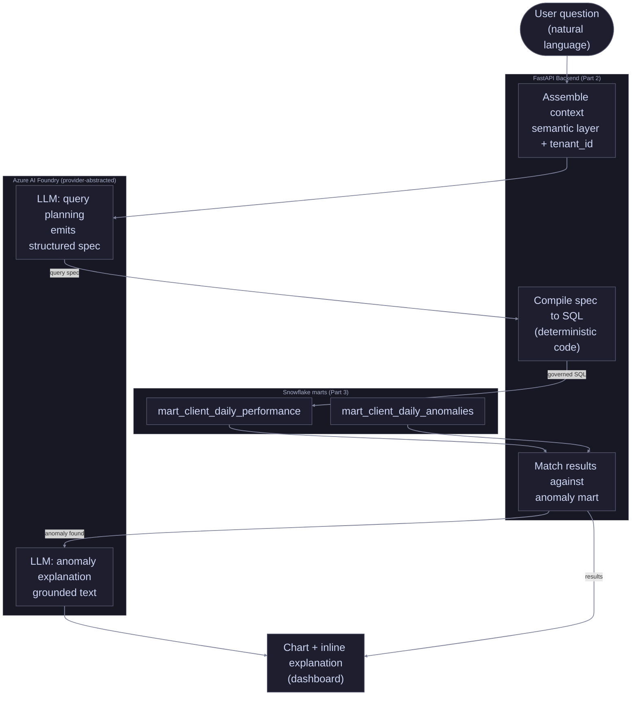

# Part 5: LLM / AI Integration

## 1. Overview

### 1.1 What this feature is

A **conversational analytics** feature: users describe the data they want in plain language, get a chart back, with anomalies explained inline.

### 1.2 How it connects

Not a standalone product. The feature:

- Queries the Part 3 marts.
- Runs on the Part 1 platform.
- Inherits Part 1's tenant isolation.
- Surfaces inside the dashboard.

The natural-language front door to data the platform already holds.

## 2. The Feature & Its Justification

**Decision:** Conversational analytics. User asks in natural language → governed query over the Part 3 marts → chart + inline anomaly explanation when the result includes a Part 3-flagged row.

### 2.1 What the feature does

User example: *"show CPA by client for the last 30 days"* or *"which clients had the worst ROAS last week"*.

1. Interpret the request → governed query against the marts.
2. Run the query → render the result as a chart.
3. If any returned row is in `mart_client_daily_anomalies` (Part 3 §10), add a plain-language explanation: what was anomalous, the likely shape of the cause, what to look at next.

Two capabilities, one feature: **self-serve querying** + **anomaly explanation** as a layer on the results, not a separate tool.

### 2.2 Who it serves

Both user types from Part 1 §4:

- **External clients** exploring their own performance.
- **Internal agency staff** exploring across the portfolio.

Without this, ad-hoc questions wait for a pre-built dashboard or for an analyst to write SQL. The feature collapses the loop: question → chart in seconds, no SQL, no queue. Each user's queries are bounded by their tenant access (§3.5); external clients only ask about their own data.

### 2.3 Why an LLM

The task: map **ambiguous natural language to a precise, structured query**.

- LLMs do this well; rule-based systems do it badly.
- Question space is open-ended, phrasing varies endlessly, intent has to be inferred.
- The non-LLM alternative is fixed filters and dropdowns — which is just the existing dashboard.
- The value of this feature is answering questions nobody pre-built a control for.

The anomaly-explanation half is also a natural-language task: grounded, readable explanation of a structured anomaly row.

### 2.4 When an LLM would be the wrong choice

- **If the question space were small and fixed**, dropdowns would beat an LLM: cheaper, deterministic, no hallucination risk.
- **If a wrong query were intolerable**, the non-determinism would be a liability.

**The defining principle:** the LLM **translates intent, it never invents data**. It picks from governed metrics; numbers always come from the database, never the model. §3 and §4 enforce that boundary.

## 3. Feature Architecture & Model Hosting

Every choice below enforces §2.4's principle.

### 3.1 Model hosting

**Decision:** Azure AI Foundry, behind a thin `LLMProvider` abstraction.

- Azure-first; same cloud / identity / observability stack as the rest of the platform.
- Feature calls the model through the abstraction, not a vendor SDK directly.
- Swap to AWS Bedrock or GCP Vertex AI = change one module.
- Azure AI Foundry and AWS Bedrock can both serve **Claude** — a provider swap need not even change the model. Makes the abstraction genuinely cheap, not aspirational.

**Alternatives considered:**

- **AWS Bedrock.** Lose Azure-first integration; otherwise equivalent shape and model availability.
- **GCP Vertex AI.** Same — different cloud, otherwise equivalent. Hosts Gemini and Gemma in addition to third-party models.

### 3.2 The semantic layer

**Decision:** The LLM queries a **curated semantic layer**, not the warehouse directly.

The catalog:

- **Metrics:** `cpa`, `roas`, `spend`, `conversions`, `revenue`, each defined once against the Part 3 marts.
- **Dimensions:** `client`, `date`, `platform`, etc.
- **Sources:** governed marts (`mart_client_daily_performance`, `mart_client_daily_anomalies`).

Two jobs:

- Gives the LLM a precise menu to choose from, not a raw schema to interpret.
- Control point where an admin decides what's queryable. A metric not in the semantic layer cannot be asked for.

### 3.3 The LLM emits a query spec, not SQL

**Decision:** The LLM emits a **structured query specification** (JSON), not SQL. Deterministic backend code compiles the spec into SQL.

- LLM held to the spec shape via structured-output / JSON mode.
- Compiler only knows the semantic layer.
- Malformed or out-of-catalog specs rejected before any query runs.

Eliminates whole classes of risk at the source:

- **No SQL injection** — LLM never produces SQL.
- **No invented tables or broken joins** — compiler only knows the catalog.
- **The LLM picks from a menu; tested code builds the query.**

**Alternative considered: let the LLM write SQL directly.** Faster to prototype, no compiler to build. Loses every safety property above. Standard at hobby scale; unsafe at any tenant boundary.

### 3.4 The request flow

Step by step:

1. User asks a question in the dashboard.
2. Backend assembles context: semantic-layer catalog, few-shot examples, authenticated user's `tenant_id`.
3. Planning LLM call returns a structured query spec.
4. Compiler validates the spec against the semantic layer, compiles to SQL.
5. SQL runs against Snowflake marts under the user's tenant context (§3.5).
6. Results matched against `mart_client_daily_anomalies`.
7. If a flagged row is present, a second grounded LLM call generates the explanation.
8. Chart + inline explanation returned to the dashboard.

The two LLM calls are deliberately separate:

- **Planning** produces structured output, held to the spec schema.
- **Explanation** produces prose, grounded in a specific anomaly row.

Different jobs, different prompts, different guardrails (§4).

### 3.5 Tenant isolation is inherited, not reinvented

A natural-language query feature is a serious tenant-leak risk. The design inherits Part 1's isolation in three layers:

1. **LLM never receives another tenant's data.** Context assembly includes only the requesting user's `tenant_id`. Nothing cross-tenant to leak.
2. **Compiler injects the tenant boundary.** Every compiled query scoped to the session's `tenant_id`; the LLM's spec cannot widen it.
3. **Row-level security is the backstop.** Queries run under Part 1's RLS policy; even a flawed compiler physically cannot return another tenant's rows.

The LLM is the **least-trusted component**. It influences *which* governed query runs; it has no power over *what data the query can see*.

## 4. Guardrails

§3 built the strongest guardrails into the architecture (semantic layer, spec-not-SQL, inherited tenant isolation). This section covers the rest, organized by where in the flow they act.

### 4.1 Input guardrails

- **Prompt injection.** User text treated as data, not instructions. Placed in a delimited section of the prompt; the planning prompt instructs the model to interpret it only as a question. The deeper defense is structural: an injection attempt can at worst produce a malformed or out-of-catalog spec, which the compiler rejects (§3.3). **Spec-not-SQL is the primary injection defense.**
- **Input validation.** Length-capped; empty or malformed requests rejected before any model call.
- **Abuse limits.** Per-user request rate limits bound cost and load.

### 4.2 Query-execution guardrails

- **Read-only by role.** The feature connects with a DB role that has `SELECT` only on the marts schema. No compiled query can write, ever.
- **Cost and scope limits.** Every compiled query has a row limit and a statement timeout. Broad requests can't scan or return unbounded results.
- **Spec validation.** Out-of-catalog or malformed specs rejected before execution (§3.3).
- **Tenant scope.** Compiler injects the tenant boundary; RLS is the backstop (§3.5).

### 4.3 Output guardrails

Chart numbers come from the query, never the model. The only generated content to guard is the anomaly explanation.

- **Grounding.** Explanation call receives only the flagged anomaly row and computed stats (z-score, trailing mean) from `mart_client_daily_anomalies`.
- **No invented figures.** Output must not introduce numbers absent from input. Enforced by instruction, low temperature, and checking numeric tokens against input.
- **Cause described, not asserted.** Describe the likely *shape* of a cause ("a spend increase without matching conversions"). Don't assert a specific root cause as fact. Data shows what happened; rarely proves why.
- **PII.** Marts hold campaign/client aggregates, no personal data → prompts carry no PII by construction. Stated as a guardrail because it must remain true: any future data source is screened before entering the semantic layer.

### 4.4 Operational guardrails

- **Cost controls.** Per-request token budgets + per-tenant daily caps. Usage monitored in §5.
- **Graceful fallback.** If the model is unavailable, times out, or returns unparseable output, the feature says so and offers the standard dashboard filters. A failed LLM call never blocks access to the rest of the platform.
- **Clarify rather than guess.** If the planning model can't confidently map a question to the semantic layer, it returns "needs clarification." A wrong query is worse than a follow-up question.

## 5. Monitoring

**Decision:** Two halves — operational signals (any service) + LLM-specific signals (cost, behavior, quality). All plug into the Part 1 §8 observability stack. The feature emits through OpenTelemetry into Azure Monitor; Azure AI Foundry's built-in tracing covers model calls.

### 5.1 Operational signals

- **Latency**, per stage: planning LLM call, spec compile, warehouse query, explanation LLM call. Shows whether slowness is the model or the database.
- **Error and timeout rates** per LLM call.
- **Request volume**, including usage relative to the standard dashboard.

### 5.2 Cost and usage signals

- **Token usage** (input + output) per request and per call type.
- **Cost per request** and aggregate, tracked per tenant against §4.4 daily caps.
- **Alerting** when a tenant nears its cap or aggregate cost trends up. A prompt change can move cost sharply.

### 5.3 Quality and behavior signals

Reveal whether the model is still doing its job:

- **Spec validity rate** — share of planning calls that produced a valid, in-catalog spec.
- **Clarification rate** — how often the feature asked the user to rephrase.
- **Guardrail trigger rates** — injection attempts, rejected specs, failed output checks, fallbacks.
- **Refusal and fallback rate.**

Rising clarification/rejection rates are an early warning that something regressed: prompt change, model version update, or drift between semantic layer and marts.

### 5.4 User feedback

- **Explicit:** thumbs up/down on each chart and explanation.
- **Implicit:** did the user accept the chart, rephrase immediately, or abandon.

Feedback is more than a health signal — it's the labeled data that feeds the §6 evaluation set.

### 5.5 Tracing and the diagnosis path

Every request logs a full trace: question, assembled context, query spec, compiled SQL, result shape, explanation. Tied together by a correlation ID + `tenant_id` (Part 1 §8).

- Makes a bad answer debuggable. The pipeline has distinct stages, so a trace shows exactly which one misfired: wrong query spec, compiler issue, unexpected warehouse result.
- Without the trace, "the chart looked wrong" is unfalsifiable. With it, the failure is located in seconds.
- The trace log is also the raw material the §6 evaluation set is built from.

## 6. Evaluation Metrics

**Decision:** A graded evaluation set with regression-gated changes. Monitoring (§5) shows the feature is running; evaluation shows it's **right**. A feature can be fast, cheap, well-monitored, and confidently wrong.

LLM output is non-deterministic → correctness needs a graded eval set, not a fixed unit test.

Two LLM-driven outputs evaluated differently:

- **Query plan** — did the model choose the right query?
- **Anomaly explanation** — is the generated text faithful and useful?

### 6.1 The evaluation set

Curated, versioned, labeled cases:

- For planning: `(question, expected query spec)` pairs.
- For explanation: `(anomaly row, reference explanation)` pairs.

Built from real request traces (§5.5), user feedback (§5.4), and hand-authored edge cases. Spans the range: simple questions, ambiguous ones that should trigger clarification, ones that should be refused. Every production failure becomes a new case → grows into a regression suite.

### 6.2 Metrics for query planning

Has ground truth → the more measurable half:

- **Spec accuracy** — generated spec matches expected, scored per component (metric, dimensions, filters, time range). Near-miss earns partial credit.
- **Executable correctness** — query compiled from the generated spec returns the same result set as the reference spec's query. **The metric that matters most**: two specs can differ in wording yet be equivalent, and the user only sees the result.
- **Clarification precision and recall** — on ambiguous questions, did it ask for clarification; on clear ones, did it answer.

### 6.3 Metrics for the anomaly explanation

Open-ended text → groundedness-style dimensions:

- **Faithfulness** — output states only what input (anomaly row + stats) supports. No invented numbers, no cause asserted as fact.
- **Relevance** — addresses the actual flagged anomaly.
- **Helpfulness** — accurate, gives the reader a sensible next step.

### 6.4 LLM-as-judge and human review

- **LLM-as-judge.** Separate model scores each explanation against a rubric and grounding input. Scales to the whole eval set; well-suited to faithfulness and relevance. Judge isn't trusted blindly — its scores are sampled against human judgment to confirm calibration.
- **Human review.** Regular sampled review of production outputs and judge scores. Ground truth that keeps the automated evaluation honest; source of new labeled cases.

### 6.5 The regression gate

Prompts and the model version are versioned artifacts; the eval set is their test suite.

- No prompt change, model version update, or semantic-layer change ships without running the full set.
- A change must not push headline metrics (executable correctness, spec accuracy, faithfulness) below their thresholds.

LLM equivalent of the CI gate in Part 1 §7.3: no code change ships without passing tests; same principle applied to the non-deterministic parts of the system.

## 7. Summary

- **Conversational analytics:** natural-language input → governed query → chart + inline anomaly explanation when applicable (§2).
- **One principle:** the LLM translates intent, never invents data.
- **Azure AI Foundry**, provider-abstracted (§3.1).
- **Semantic layer** the LLM picks from (§3.2).
- **LLM emits a query spec, not SQL** — deterministic code compiles + runs (§3.3).
- **Tenant isolation inherited** from Part 1 (§3.5).
- **Guardrails** contain the LLM as the least-trusted component (§4).
- **Monitoring** covers operational, cost, quality, feedback (§5).
- **Versioned evaluation set** gates every prompt and model change (§6).

### Requirements coverage

Each Part 5 requirement from the [root README](../README.md#requirements) (`FR-` = functional, `NFR-` = non-functional):

| Requirement | Addressed in |
|-------------|--------------|
| FR-5.1 Design and justify an LLM-powered feature | §2, §3 |
| FR-5.2 Monitoring | §5 |
| FR-5.3 Guardrails | §3.3, §3.5, §4 |
| FR-5.4 Evaluation metrics | §6 |
| NFR-13 AI safety (guardrails and measurable evaluation) | §4, §6 |

---

## Decision Log

| Area              | Decision                                                       | Reasoning |
| ----------------- | -------------------------------------------------------------- | --------- |
| Feature           | Conversational analytics with inline anomaly explanation       | _§2_      |
| Model hosting     | Azure AI Foundry, provider-abstracted                          | _§3.1_    |
| Semantic layer    | Curated metric/dimension catalog                               | _§3.2_    |
| LLM output shape  | Structured query spec, not SQL                                 | _§3.3_    |
| Monitoring        | Azure Monitor / App Insights via OpenTelemetry                 | _§5_      |
| Evaluation gate   | Regression set must pass before any prompt or model change     | _§6.5_    |
